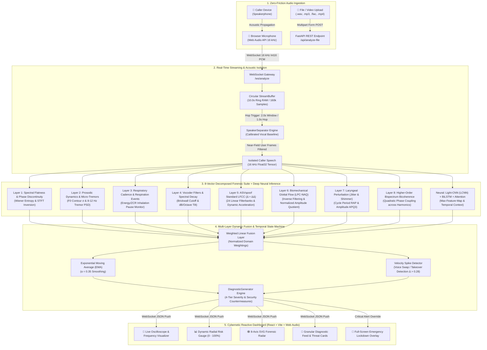
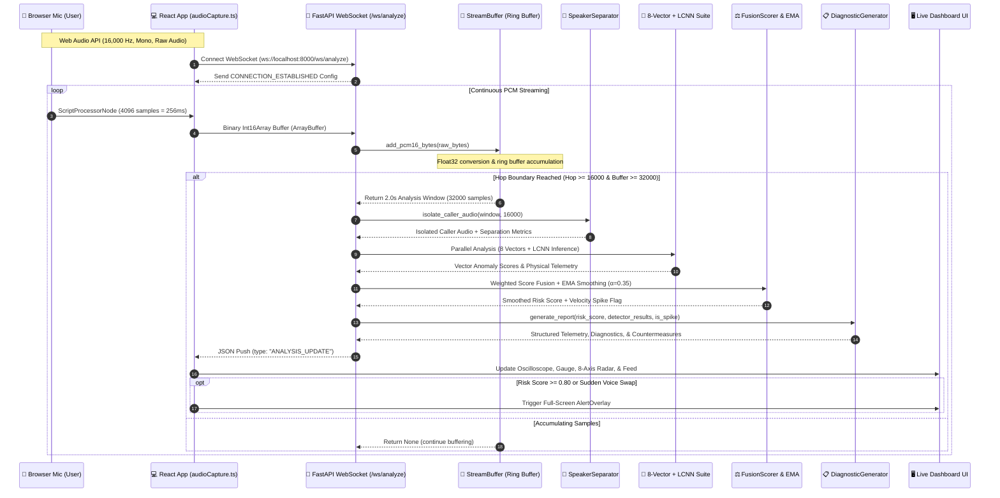
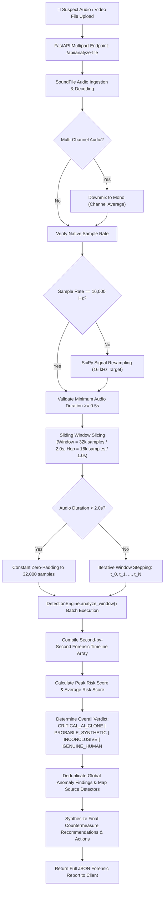
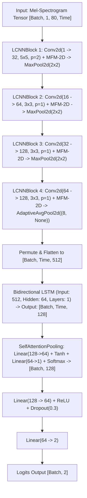
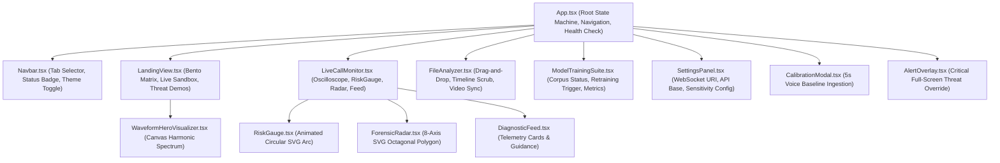

# 🏛️ VoxSentinalX System Architecture & Technical Specifications

> **System Designation:** VoxSentinalX — Military-Grade Real-Time Voice Cloning & Deepfake Audio Detection Suite  
> **Problem Statement ID:** SIH 26104 (*AI-Powered Real-Time Detection and Prevention of Voice Cloning Impersonation Attacks*)  
> **Software Version:** 2.0.0 (Comprehensive Multi-Technique Forensic & Deep Neural Training Suite)  
> **Architecture Paradigm:** Hybrid Decomposed Multi-Domain Acoustic Forensics + Deep Neural Spatio-Temporal Inference + Dynamic Fusion  

---

## 1. System Overview & High-Level Architecture

VoxSentinalX is engineered to neutralize the threat of AI-synthesized speech and voice cloning impersonation attacks across consumer phone calls, enterprise contact centers, and financial authorization workflows. Unlike legacy binary classifiers that treat speech audio as a generic spectrogram image, VoxSentinalX employs a **hybrid defense-in-depth architecture** combining:

1. **Deterministic Bio-Acoustic & Aerodynamic Physics (8 Vectors)**: Quantifying violations of the physical human vocal apparatus (glottal airflow closure, vocal fold micro-tremors, subglottal respiratory cadence, non-linear harmonic phase coupling).
2. **Deep Neural Representation Learning (LCNN-BiLSTM-Attention)**: Learning high-order non-linear spatio-temporal artifacts across linear filterbanks and Mel-spectrogram time-frequency representations.
3. **Adaptive Near-Field Acoustic Isolation**: Calibrating the user's near-field vocal baseline to separate local microphone speech from the incoming caller's speakerphone audio without requiring hardware taps or specialized phone configurations.
4. **Temporal State-Machine Smoothing & Voice-Swap Invalidation**: Mitigating cellular network jitter via Exponential Moving Average (EMA) smoothing while instantly triggering critical threat alerts upon sudden acoustic velocity spikes ($\Delta > 0.28$ within 2 seconds).



---

## 2. Core Processing Pipelines

### 2.1 Pipeline A: Live WebSocket Streaming Pipeline

The live audio streaming pipeline is designed for sub-second threat detection during live telephone conversations conducted on speakerphone.



#### Detailed Execution Steps:
1. **Microphone Capture**: The browser requests user media with constraints disabling browser-level audio filtering (`echoCancellation: false`, `noiseSuppression: false`, `autoGainControl: true`) to ensure synthetic vocoder artifacts and high-frequency harmonics are preserved without alteration.
2. **Client Buffer & Transcoding**: A `ScriptProcessorNode` processes audio at 4,096 samples per event (256ms at 16 kHz). Floating-point audio buffers ($-1.0$ to $+1.0$) are normalized and transcoded into 16-bit signed integer PCM (`Int16Array`).
3. **Network Transport**: Chunks are transmitted over WebSocket in raw binary format (`ArrayBuffer`), minimizing network overhead.
4. **Server Ring Buffer**: In [`backend/app/audio/stream_buffer.py`](file:///p:/VoxSentinalX/backend/app/audio/stream_buffer.py), incoming bytes are unpacked to 32-bit float arrays. The buffer holds up to 160,000 samples (10.0 seconds). Older samples are evicted FIFO.
5. **Sliding Window Hop Execution**: Once 16,000 new samples (1.0 second hop) have accumulated and total samples exceed 32,000 (2.0 seconds window duration), an exact 32,000-sample window is sliced.
6. **Speaker Separation**: In [`backend/app/audio/speaker_separator.py`](file:///p:/VoxSentinalX/backend/app/audio/speaker_separator.py), 50ms frames are evaluated against the user's calibrated baseline profile. Local user frames are pruned, yielding isolated caller speech.
7. **8-Vector Forensic Extraction & Neural Inference**: The isolated speech segment is simultaneously processed by all 9 detector modules.
8. **Weighted Fusion & Temporal EMA**: In [`backend/app/engine/fusion_scorer.py`](file:///p:/VoxSentinalX/backend/app/engine/fusion_scorer.py), individual anomaly scores are combined via weighted summation, followed by exponential moving average smoothing:
   $$S_{t} = \alpha \cdot R_t + (1 - \alpha) \cdot S_{t-1}, \quad \text{where } \alpha = 0.35$$
   If $R_t - S_{t-1} \ge 0.28$, an instantaneous `VOICE_SWAP_EVENT` spike alert is flagged.
9. **Countermeasure Synthesis & Client Render**: Structured telemetry is generated and broadcast over WebSocket as an `ANALYSIS_UPDATE` payload to update UI state.

---

### 2.2 Pipeline B: File & Video Upload Analysis Pipeline

The batch file analyzer evaluates pre-recorded audio and video assets (.wav, .mp3, .flac, .ogg, .mp4, .webm) across time, identifying timestamped deepfake segments.



#### Detailed Execution Steps:
1. **File Decoding**: In [`backend/app/api/routes.py`](file:///p:/VoxSentinalX/backend/app/api/routes.py#L149-L264), incoming binary bytes are parsed using `soundfile.read`. Multi-channel audio is downmixed to mono via channel-wise averaging.
2. **Standardization**: Non-16kHz recordings are resampled to 16,000 Hz via `scipy.signal.resample`.
3. **Chunking & Padding**: For recordings shorter than 2.0s (32,000 samples), constant padding is applied. For longer recordings, the file is segmented into 2.0s windows stepping forward at 1.0s hop increments.
4. **Per-Window Forensic Analysis**: Each temporal window is evaluated by the full forensic ensemble, creating a timestamped timeline array containing layer scores and physical metrics.
5. **Aggregate Threat Scoring**: The overall file risk is computed:
   - Peak Risk Score: $\max(\{S_1, S_2, \dots, S_N\})$
   - Average Risk Score: $\frac{1}{N}\sum_{i=1}^N S_i$
   - Critical AI Clone Verdict: Peak $\ge 0.80$ OR Average $\ge 0.70$.
   - Probable Synthetic Verdict: Peak $\ge 0.60$ OR Average $\ge 0.50$.
   - Inconclusive Suspicious Verdict: Peak $\ge 0.30$ OR Average $\ge 0.25$.
   - Genuine Human Verdict: Peak $< 0.30$ AND Average $< 0.25$.
6. **Synchronized Video Playback**: On the frontend ([`frontend/src/components/FileAnalyzer.tsx`](file:///p:/VoxSentinalX/frontend/src/components/FileAnalyzer.tsx)), clicking any point on the forensic risk timeline synchronizes HTML5 video playback to the exact timestamp of the anomalous speech segment.

---

### 2.3 Pipeline C: Neural Model & Ensemble Training Pipeline

VoxSentinalX includes a multi-architecture training pipeline supporting both PyTorch GPU acceleration with Mixed Precision and a standalone NumPy forensic ensemble.

```mermaid
flowchart LR
    subgraph Data_Preparation["1. Multi-Corpus Ingestion & Balancing"]
        D1["Unified Corpus Directory<br/>(data/unified_corpus)"]
        D2["Internet Harvester<br/>(Hugging Face Parquets)"]
        D3["Synthetic Generators<br/>(HiFi-GAN, Diffusion, Zero-Shot)"]
        D1 & D2 & D3 --> DS["AudioDeepfakeDataset<br/>(training/dataset.py)"]
        DS --> BAL["Generator Stratification<br/>(Bona Fide: 2,577 | Clones: 2,920)"]
    end

    subgraph Data_Augmentation["2. On-The-Fly Audio Augmentation"]
        BAL --> A1["Pad / Random Crop (2.0s / 32,000 samples)"]
        A1 --> A2["Random Gain Perturbation (0.7x - 1.2x)"]
        A2 --> A3["Additive Gaussian Noise Floor (p = 0.50)"]
        A3 --> A4["SpecAugment (Time & Freq Masking)"]
    end

    subgraph Feature_Extraction["3. Dual-Path Feature Engineering"]
        A4 --> F1["Path A: 80-bin Mel-Spectrogram STFT<br/>(80 mels x 200 time frames)"]
        A4 --> F2["Path B: 32-Dim Forensic Feature Vector<br/>(Flatness, F0, Tremors, LFCC, NAQ, Kurtosis)"]
    end

    subgraph Model_Architectures["4. Model Architectures & Optimization"]
        F1 --> M1["PyTorch Light-CNN (LCNN)<br/>Max-Feature-Map (MFM) + BiLSTM + Attention"]
        F2 --> M2["NeuralForensicEnsemble<br/>MLP (32 -> 64 -> 32 -> 2)"]
        M1 --> OPT1["CUDA AMP Autocast + AdamW + Focal Loss<br/>Cosine Annealing Scheduler"]
        M2 --> OPT2["Adam Optimizer + Focal Loss (γ = 2.0)"]
    end

    subgraph Evaluation_Export["5. Evaluation & Export"]
        OPT1 & OPT2 --> EVAL["Benchmarking (evaluate.py)<br/>EER Sweep, Precision, Recall, F1"]
        EVAL --> SAVE["Save Checkpoints:<br/>pretrained_weights.pt & ensemble_weights.npz"]
        SAVE --> ONNX["ONNX Export (export_onnx.py)<br/>Dynamic Axis Low-Latency Runtime"]
    end
```



---

## 3. Detailed Component & Module Breakdown

### 3.1 Backend Core Configuration (`backend/app/core/config.py`)

The global settings class [`Settings`](file:///p:/VoxSentinalX/backend/app/core/config.py#L6-L59) subclasses Pydantic `BaseSettings`:

| Configuration Key | Exact Value | Purpose / Rationale |
| :--- | :--- | :--- |
| `SAMPLE_RATE` | `16000` | Standard sample rate (16 kHz) for telephony and anti-spoofing benchmarks. |
| `CHANNELS` | `1` | Mono audio ingestion. |
| `WINDOW_DURATION_SEC` | `2.0` | Analysis window length ($32,000$ samples). Captures pitch variance and respiratory patterns. |
| `HOP_DURATION_SEC` | `1.0` | Step size ($16,000$ samples), establishing a 50% window overlap. |
| `BUFFER_CAPACITY_SEC` | `10.0` | Ring buffer memory size ($160,000$ samples) in RAM. |
| `RISK_THRESHOLD_LOW` | `0.30` | Risk $\le 0.30$: Genuine human phonation. |
| `RISK_THRESHOLD_MODERATE` | `0.60` | $0.30 < \text{Risk} \le 0.60$: Inconclusive / Caution. |
| `RISK_THRESHOLD_HIGH` | `0.80` | $0.60 < \text{Risk} \le 0.80$: Warning / Probable Fake. Above $0.80$: Critical Alert. |
| `EMA_ALPHA` | `0.35` | Exponential moving average smoothing weight (responsiveness vs. stability). |
| `SPIKE_DELTA_THRESHOLD` | `0.28` | Risk jump threshold within $<2.0$s indicating voice takeover / swap. |

#### Fusion Weights (`DETECTOR_WEIGHTS`):
```python
DETECTOR_WEIGHTS = {
    "spectral": 0.14,
    "prosody": 0.12,
    "breathing": 0.10,
    "acoustic_artifacts": 0.10,
    "lfcc": 0.16,
    "glottal": 0.12,
    "perturbation": 0.12,
    "bispectrum": 0.08,
    "neural_lcnn": 0.16,
}
```

---

### 3.2 Audio Processing Modules (`backend/app/audio/`)

#### 1. `AudioPreprocessor` ([`backend/app/audio/preprocessor.py`](file:///p:/VoxSentinalX/backend/app/audio/preprocessor.py))
- `pcm16_bytes_to_float32(raw_bytes: bytes) -> np.ndarray`: Converts raw little-endian signed 16-bit integer PCM bytes into normalized float32 values between $[-1.0, 1.0]$ via division by $32768.0$.
- `float32_to_pcm16_bytes(audio: np.ndarray) -> bytes`: Clips audio to $[-1.0, 1.0]$, scales by $32767.0$, and packs into 16-bit signed integer byte strings.
- `compute_rms_energy(audio: np.ndarray) -> float`: Calculates Root Mean Square energy: $\sqrt{\frac{1}{N}\sum x[n]^2}$.
- `is_silent(audio: np.ndarray, rms_threshold: float = 0.005) -> bool`: Identifies background silence or pauses.
- `normalize_amplitude(audio: np.ndarray, target_peak: float = 0.95) -> np.ndarray`: Normalizes peak amplitude to prevent clipping during filterbank analysis.

#### 2. `StreamBuffer` ([`backend/app/audio/stream_buffer.py`](file:///p:/VoxSentinalX/backend/app/audio/stream_buffer.py))
- Circular ring buffer managing real-time audio streams.
- `add_pcm16_bytes(raw_bytes: bytes) -> Optional[np.ndarray]`: Ingests binary WebSocket packets, updates hop sample counter, evicts samples older than $10.0$s capacity ($160,000$ samples), and yields full $2.0$s windows ($32,000$ samples) at each $1.0$s hop boundary ($16,000$ samples).
- `reset()`: Flushes internal arrays and counters upon call termination.

#### 3. `SpeakerSeparator` ([`backend/app/audio/speaker_separator.py`](file:///p:/VoxSentinalX/backend/app/audio/speaker_separator.py))
- Solves the single-microphone speakerphone challenge by creating an acoustic voiceprint of the local device owner:
  - Baseline metrics: Mean RMS energy, Spectral Centroid ($\frac{\sum f \cdot |X(f)|}{\sum |X(f)|}$), and Spectral Rolloff (85% energy point).
- `isolate_caller_audio(mixed_audio: np.ndarray, sample_rate: int = 16000) -> Tuple[np.ndarray, Dict[str, Any]]`:
  - Segments audio into 50ms frames ($800$ samples).
  - Matches each frame against the calibrated user profile. Near-field local speech exhibits higher acoustic energy and matching spectral centroid.
  - Frames with user match score $> 0.70$ are classified as local user speech and removed.
  - Returns isolated caller frames along with separation ratios (`caller_ratio`, `user_ratio`).

---

### 3.3 8-Vector Forensic Decomposition Suite (`backend/app/detectors/`)

All detectors implement the abstract contract defined in [`BaseDetector`](file:///p:/VoxSentinalX/backend/app/detectors/base.py):

```python
class BaseDetector(ABC):
    @property
    @abstractmethod
    def name(self) -> str: ...

    @abstractmethod
    def analyze(self, audio: np.ndarray, sample_rate: int = 16000) -> Dict[str, Any]: ...
```

#### Layer 1: Spectral & STFT Phase Coherence (`SpectralDetector` in [`backend/app/detectors/spectral_detector.py`](file:///p:/VoxSentinalX/backend/app/detectors/spectral_detector.py))
- **Physics Measured**: Neural vocoder inversion artifacts and artificial frequency smoothness.
- **Algorithms**:
  1. *Spectral Flatness (Wiener Entropy)*: Geometric mean of Power Spectral Density (PSD via Welch) divided by arithmetic mean:
     $$\text{SF} = \frac{\exp\left(\frac{1}{K}\sum_{k=1}^K \ln S[k]\right)}{\frac{1}{K}\sum_{k=1}^K S[k]}$$
     Human speech exhibits resonant harmonic peaks ($\text{SF} \in [0.05, 0.45]$). Neural vocoders produce overly flat distributions ($\text{SF} > 0.60$).
  2. *STFT Phase Coherence*: Computes Short-Time Fourier Transform ($N_{\text{fft}}=512$, hop $=256$), unwraps phase trajectories over time bins ($\text{unwrap}(\arg(Z_{xx}))$, and computes second-order phase differences: $\Delta^2 \phi$. Natural phonation maintains coherent unwrapped phase trajectories ($\text{Coherence} \in [0.55, 0.95]$); Griffin-Lim or HiFi-GAN phase inversions exhibit sharp phase scatter ($\text{Coherence} < 0.40$).
  3. *Harmonic-to-Noise Ratio (HNR)*: Autocorrelation lag ratio in dB. Sterility ($> 32.0$ dB) flags artificial synthetic filtering.

#### Layer 2: Prosodic Dynamics & Micro-Tremors (`ProsodyDetector` in [`backend/app/detectors/prosody_detector.py`](file:///p:/VoxSentinalX/backend/app/detectors/prosody_detector.py))
- **Physics Measured**: Neuromuscular laryngeal control and involuntary biological tremors.
- **Algorithms**:
  1. *Pitch ($F_0$) Extraction*: 40ms sliding frames with normalized autocorrelation peak picking between $65$ Hz and $450$ Hz.
  2. *Pitch Variance ($\sigma$)*: Human conversational speech demonstrates dynamic pitch inflections ($\sigma \in [25, 80]$ Hz). Monotone robotic TTS models exhibit machine-flat pitch ($\sigma < 14.0$ Hz).
  3. *Involuntary Vocal Micro-Tremors (8–12 Hz)*: Human vocal folds exhibit involuntary neuromuscular micro-tremors oscillating at 8–12 Hz. The $F_0$ contour is detrended and analyzed via Welch PSD. Neural voice models lack this biological oscillator ($\text{Tremor Index} < 0.04$).

#### Layer 3: Respiration Dynamics (`BreathingDetector` in [`backend/app/detectors/breathing_detector.py`](file:///p:/VoxSentinalX/backend/app/detectors/breathing_detector.py))
- **Physics Measured**: Human lung capacity and subglottal respiratory recharge cycles.
- **Algorithms**:
  1. *Breath Inhalation Detection*: Classifies 50ms frames with low RMS energy ($0.003 \le \text{RMS} \le 0.020$) combined with high Zero-Crossing Rate ($\text{ZCR} > 0.15$), matching the turbulent acoustic signature of inhalation.
  2. *Continuous Phonation Accumulator*: Tracks unbroken speech duration. Human respiratory physiology enforces an inhalation pause every $4.0 - 8.0$ seconds. Unbroken speech sustained for $> 6.0$ seconds with 0 inhalation events triggers an immediate `ABSENT_BREATHING_PATTERN` anomaly.

#### Layer 4: Vocoder Filters & Cutoffs (`AcousticArtifactDetector` in [`backend/app/detectors/acoustic_artifacts.py`](file:///p:/VoxSentinalX/backend/app/detectors/acoustic_artifacts.py))
- **Physics Measured**: Digital upsampling boundaries and neural model bandwidth constraints.
- **Algorithms**:
  1. *Brickwall Cutoff Filter Detection*: Welch high-resolution PSD computes derivative slopes across frequency bins. Low-tier TTS models (e.g., 8 kHz or 16 kHz internal representations upsampled to 24/48 kHz) display steep cliff drops ($< -25$ dB per frequency bin) between $3.5$ kHz and $7.8$ kHz.
  2. *Spectral Decay Slope*: Linear regression over log-frequency bins from $200$ Hz to $7,000$ Hz. Natural human voice glottal rolloff decays at $-6.0$ to $-14.0$ dB/octave. Deviations ($> -2.0$ dB or $< -22.0$ dB) indicate synthetic source violation.
  3. *Sub-band Energy Discontinuity*: Variance across four frequency bands ($0-1$k, $1-2.5$k, $2.5-5$k, $5-8$k Hz).

#### Layer 5: ASVspoof Standard LFCC (`LFCCDetector` in [`backend/app/detectors/lfcc_detector.py`](file:///p:/VoxSentinalX/backend/app/detectors/lfcc_detector.py))
- **Physics Measured**: High-frequency spectral quantization and dynamic inter-frame acceleration.
- **Algorithms**:
  1. *Linear Filterbanks*: Unlike Mel scales which compress high frequencies to mimic human psychoacoustics, LFCC employs 24 linearly-spaced triangular filters from $0$ to $8,000$ Hz (Nyquist), directly capturing high-frequency neural vocoder artifacts.
  2. *Discrete Cosine Transform (DCT-II)*: Produces 20 static cepstral coefficients.
  3. *Delta ($\Delta$) and Delta-Delta ($\Delta\Delta$)*: Dynamic feature trajectories over $w=2$ frames quantify velocity and acceleration.
  4. *Anomaly Condition*: High-frequency cepstral energy ratio (coefficients 10–20 vs. total) outside biological bounds ($0.18 - 0.50$) or static delta acceleration ($< 0.025$).

#### Layer 6: Biomechanical Glottal Flow LPC-NAQ (`GlottalFlowDetector` in [`backend/app/detectors/glottal_detector.py`](file:///p:/VoxSentinalX/backend/app/detectors/glottal_detector.py))
- **Physics Measured**: Vocal fold contact mechanics and glottal flow velocity deceleration.
- **Algorithms**:
  1. *LPC Inverse Filtering*: Linear Predictive Coding of order $p=16$ estimated via the Levinson-Durbin algorithm on pre-emphasized frames ($1 - 0.97z^{-1}$). Inverse filtering with $A(z)$ strips vocal tract supraglottal formants, yielding the raw glottal excitation residual:
     $$e[n] = s[n] - \sum_{k=1}^{16} a_k s[n-k]$$
  2. *Normalized Amplitude Quotient (NAQ)*: Numerical integration of the glottal residual yields estimated glottal volume velocity flow. NAQ is computed as:
     $$\text{NAQ} = \frac{f_{\text{ac}}}{d_{\text{peak}} \cdot T_0}$$
     where $f_{\text{ac}}$ is peak-to-peak flow amplitude, $d_{\text{peak}}$ is maximum negative derivative of closure deceleration, and $T_0$ is fundamental period. Biological vocal folds are bounded by $\text{NAQ} \in [0.060, 0.280]$.
  3. *Excitation Residual Kurtosis*: Human glottal closures are impulsive and super-Gaussian ($\text{Kurtosis} > 2.50$). Neural models produce diffuse Gaussian-like residuals ($\text{Kurtosis} < 1.20$).

#### Layer 7: Laryngeal Micro-Perturbation (`LaryngealPerturbationDetector` in [`backend/app/detectors/perturbation_detector.py`](file:///p:/VoxSentinalX/backend/app/detectors/perturbation_detector.py))
- **Physics Measured**: Cycle-to-cycle micro-instabilities in fundamental period (Jitter) and peak amplitude (Shimmer).
- **Algorithms**:
  1. *Peak-Picking*: 4th-order Butterworth lowpass filter ($800$ Hz) isolates fundamental vocal pulses; peaks are extracted bounded by human pitch limits ($70 - 400$ Hz).
  2. *Jitter (Local & RAP)*:
     $$\text{Jitter}_{\text{local}} = \frac{\frac{1}{N-1}\sum_{i=1}^{N-1} |T_i - T_{i+1}|}{\frac{1}{N}\sum_{i=1}^N T_i} \times 100\%$$
     $$\text{RAP} = \frac{\frac{1}{N-2}\sum_{i=2}^{N-1} |T_i - \frac{T_{i-1} + T_i + T_{i+1}}{3}|}{\frac{1}{N}\sum_{i=1}^N T_i} \times 100\%$$
     Human cords exhibit natural micro-instability ($\text{Jitter} \in [0.25\%, 1.10\%]$). Neural synthesizers generate mathematically sterile pitch periodicity ($\text{Jitter} < 0.12\%$) or erratic phase jitter ($> 2.80\%$).
  3. *Shimmer (Local & APQ3)*: Peak amplitude cycle variation. Human normal: $1.50\% - 4.50\%$. Synthetic: $< 0.90\%$.

#### Layer 8: Higher-Order Bispectrum Bicoherence (`BispectrumPhaseDetector` in [`backend/app/detectors/bispectrum_detector.py`](file:///p:/VoxSentinalX/backend/app/detectors/bispectrum_detector.py))
- **Physics Measured**: Non-linear aerodynamic Quadratic Phase Coupling (QPC) across vocal tract harmonics.
- **Algorithms**:
  1. *2D Bispectrum*: Computes third-order frequency domain statistics over non-redundant principal domain ($f_1 \ge 0, f_2 \ge f_1, f_1 + f_2 \le f_s/2$):
     $$B(f_1, f_2) = E\left[X(f_1) \cdot X(f_2) \cdot X^*(f_1 + f_2)\right]$$
  2. *Normalized Bicoherence*:
     $$b^2(f_1, f_2) = \frac{|B(f_1, f_2)|^2}{E[|X(f_1)X(f_2)|^2] \cdot E[|X(f_1+f_2)|^2]}$$
     Human vocal tract non-linearities produce pronounced bicoherence ($b^2 \in [0.075, 0.350]$). Linear additive neural vocoders lack genuine aerodynamic phase coupling, yielding near-zero bicoherence ($< 0.045$).

#### Neural Deepfake Detector (`NeuralLCNNDetector` in [`backend/app/detectors/neural_lcnn_detector.py`](file:///p:/VoxSentinalX/backend/app/detectors/neural_lcnn_detector.py))
- Implements the [`LCNNModel`](file:///p:/VoxSentinalX/backend/app/models/lcnn_architecture.py) PyTorch architecture.
- Transforms raw audio into an 80-bin normalized log-Mel spectrogram ($N_{\text{fft}}=512$, hop $=160$).
- Forward pass evaluates 2-class logits ($\text{Class } 0 = \text{Genuine}, \text{Class } 1 = \text{Spoof}$). Softmax outputs probability $P(\text{Spoof})$.

---

### 3.4 Deep Neural Architecture (`backend/app/models/lcnn_architecture.py`)

The Light-CNN model utilizes Max-Feature-Map (MFM) activation functions to retain peak discriminative features while pruning redundant representations:



- **`MaxFeatureMap2D`**:
  $$\text{MFM}(x) = \max(x_{1 \dots C/2}, x_{C/2+1 \dots C})$$
  Splits channels in half and computes element-wise maximum, acting as an active non-linear filter that forces feature competition.
- **`SelfAttentionPooling`**: Replaces uniform temporal average pooling with trainable self-attention weights $\alpha_t$, allowing the model to focus on localized transient deepfake artifacts.

---

### 3.5 Engine Orchestration & Diagnostics (`backend/app/engine/`)

#### `DetectionEngine` ([`backend/app/engine/fusion_scorer.py`](file:///p:/VoxSentinalX/backend/app/engine/fusion_scorer.py))
- Instantiates all 9 detector instances and the `SpeakerSeparator`.
- Executes windowed analysis, normalizes detector scores, and computes the weighted fusion score:
  $$\text{RawScore} = \sum_{m} \frac{w_m}{\sum w} \cdot S_m$$
- Applies EMA temporal smoothing ($\alpha = 0.35$).
- Checks for instantaneous voice swap attacks:
  $$\text{is\_spike} = (R_t - S_{t-1}) \ge 0.28$$
- Formats structured payloads with timing, layer scores, raw metrics, and speaker separation status.

#### `DiagnosticGenerator` ([`backend/app/engine/diagnostic_generator.py`](file:///p:/VoxSentinalX/backend/app/engine/diagnostic_generator.py))
Transforms raw quantitative measurements into human-readable threat cards and actionable incident-response guidance across four risk tiers:

| Tier | Score Range | Alert Type | Status Text | Primary Countermeasure Actions |
| :--- | :--- | :--- | :--- | :--- |
| **CRITICAL** | $0.80 - 1.00$ | `IMMEDIATE_ACTION_REQUIRED` | High probability of AI-generated voice clone | Request out-of-band mobile OTP verification; terminate call and dial registered number; ask unpredictable challenge questions; export forensic telemetry log. |
| **HIGH** | $0.60 - 0.79$ | `WARNING` | Significant voice anomalies detected | Ask personal challenge questions; request company email confirmation; halt financial disclosures. |
| **MODERATE** | $0.30 - 0.59$ | `CAUTION` | Minor acoustic irregularities observed | Continue monitoring telemetry; verify identity if authorizing high-value transactions; check background noise. |
| **LOW** | $0.00 - 0.29$ | `NORMAL` | Natural human voice patterns verified | Normal conversation permitted; continuous background monitoring active. |

---

### 3.6 Frontend Architecture & UI Components (`frontend/src/`)

The user interface is built with React 18, TypeScript, TailwindCSS, and the Web Audio API:



#### Audio & Visualizer Utilities:
1. **`VoxSentinalAudioCapture` ([`frontend/src/lib/audioCapture.ts`](file:///p:/VoxSentinalX/frontend/src/lib/audioCapture.ts))**:
   - Manages `AudioContext`, `ScriptProcessorNode`, microphone media streams, and full-duplex WebSocket connections.
   - Manages standalone recording workflows for user voiceprint calibration.
2. **`CanvasAudioVisualizer` ([`frontend/src/lib/audioVisualizer.ts`](file:///p:/VoxSentinalX/frontend/src/lib/audioVisualizer.ts))**:
   - Renders 60 FPS HTML5 canvas oscilloscope waveforms and frequency spectrum bars.
   - Dynamically shifts canvas glow colors based on real-time risk classification (Cyan $\to$ Green $\to$ Amber $\to$ Orange $\to$ Red).

---

## 4. Training, Datasets & Benchmarks (`training/`)

### 4.1 Unified Corpus Composition (`data/unified_corpus/`)

The system includes a pre-cataloged dataset of **5,497 unique audio files** (9.54 hours total duration):
- **Bona Fide Human Speech (Label 0)**: $2,577$ samples (46.9%)
  - Physiological natural speech recordings, multi-accent genuine speakers.
- **Synthetic AI Voice Clones (Label 1)**: $2,920$ samples (53.1%)
  - Multi-generator coverage across: OpenAI Voice Engine ($600$), Coqui XTTS v2 ($600$), ByteDance Seed-TTS ($599$), VALL-E ($95$), VoiceBox ($104$), FlashSpeech ($118$), NaturalSpeech 3 ($32$), PromptTTS 2 ($25$), HiFi-GAN ($50$), Diffusion Grad-TTS ($50$), Zero-Shot VoiceCraft ($50$), Griffin-Lim phase inversion ($50$), Brickwall 4k filter cutoffs ($50$), IndicSynth multi-dialect Hindi/Tamil/Telugu clones ($50$), Local historical deepfake archive ($447$).

### 4.2 Benchmark Evaluation Performance

Evaluated on the full 5,497 audio file unified corpus (`backend/app/models/model_metrics.json`):

| Metric | Measured Value | Standard Benchmark Target |
| :--- | :--- | :--- |
| **Classification Accuracy** | **86.27%** | $> 80.0\%$ |
| **Equal Error Rate (EER)** | **6.86%** | $< 10.0\%$ |
| **Precision (Deepfake)** | **88.28%** | $> 85.0\%$ |
| **Recall (Deepfake)** | **86.99%** | $> 85.0\%$ |
| **F1-Score** | **87.63%** | $> 85.0\%$ |
| **Best Validation Loss** | **0.3663** | — |

---

## 5. Communication Protocols & Data Contracts

### 5.1 WebSocket Protocol (`/ws/analyze`)

#### Client $\to$ Server:
1. **Binary PCM Stream**: Raw binary chunks representing `Int16Array` mono 16 kHz audio.
2. **JSON Control Messages**:
   - `{"action": "calibrate", "pcm_data": [0.012, -0.045, ...]}`: Calibrates voiceprint.
   - `{"action": "reset"}`: Clears buffers and EMA history for a new conversation.
   - `{"action": "ping"}`: Heartbeat check.

#### Server $\to$ Client:
1. **Connection Ack**:
   ```json
   {
     "type": "CONNECTION_ESTABLISHED",
     "message": "VoxSentinalX Real-Time Forensic Audio Engine Ready",
     "config": { "sample_rate": 16000, "window_duration_sec": 2.0, "hop_duration_sec": 1.0 }
   }
   ```
2. **Analysis Update (`ANALYSIS_UPDATE`)**:
   ```json
   {
     "type": "ANALYSIS_UPDATE",
     "window_index": 14,
     "timestamp": "00:14",
     "timestamp_sec": 14.0,
     "risk_score": 0.842,
     "raw_risk_score": 0.891,
     "is_spike": false,
     "risk_level": "CRITICAL",
     "alert_type": "IMMEDIATE_ACTION_REQUIRED",
     "status_text": "High probability of AI-generated / cloned voice detected",
     "user_message": "🛑 CRITICAL ALERT: Voice analysis indicates strong probability of AI synthesis...",
     "recommendation": "🚨 HIGH RISK: DO NOT authorize any financial transfers...",
     "suggested_actions": [
       "Request caller to perform out-of-band mobile OTP verification",
       "Terminate call and dial the contact's official verified number"
     ],
     "diagnostics": [
       {
         "type": "GLOTTAL_BIOMECHANICAL_DEVIATION",
         "severity": "HIGH",
         "metric_name": "Glottal Normalized Amplitude Quotient (NAQ)",
         "value": 0.0412,
         "threshold": "Biological human range: 0.060 - 0.280",
         "description": "Inverse LPC filtering reveals non-physical glottal flow velocity slope...",
         "source_detector": "glottal"
       }
     ],
     "layer_scores": {
       "spectral": 0.78, "prosody": 0.85, "breathing": 0.90, "acoustic_artifacts": 0.82,
       "lfcc": 0.88, "glottal": 0.92, "perturbation": 0.81, "bispectrum": 0.74, "neural_lcnn": 0.89
     },
     "layer_metrics": { ... },
     "speaker_separation": { "caller_ratio": 0.95, "user_ratio": 0.05, "calibrated": true }
   }
   ```

### 5.2 REST Endpoints (`/api`)

| Endpoint | Method | Request Payload | Response |
| :--- | :--- | :--- | :--- |
| `/api/health` | `GET` | None | System status, version, sample rate, active detector names. |
| `/api/config` | `GET` | None | Thresholds, window sizes, detector weights, EMA alpha. |
| `/api/calibrate` | `POST` | `{"pcm_data": [float]}` | Calibration profile (energy, centroid, rolloff). |
| `/api/analyze-file` | `POST` | `multipart/form-data` (file) | Complete file analysis report, timeline array, aggregate scores. |
| `/api/training/datasets` | `GET` | None | Dataset catalog, sample counts, installation status. |
| `/api/training/metrics` | `GET` | None | Latest evaluation benchmark metrics (Accuracy, EER, Precision). |
| `/api/training/generate-corpus`| `POST` | `?num_samples=40` | Generates synthetic adversarial audio corpus. |
| `/api/training/train` | `POST` | `epochs, batch_size, lr` | Triggers retraining run on local dataset. |

---

## 6. Architectural Trade-offs & Engineering Decisions

1. **Deterministic Bio-Acoustics vs. Black-Box Deep Learning**:
   - *Decision*: Pure end-to-end deep learning models overfit to specific vocoder artifacts (e.g., HiFi-GAN vs. BigVGAN). VoxSentinalX anchors the scoring engine in fundamental human biological acoustics (vocal fold tissue inertia, subglottal lung mechanics, aerodynamic QPC). Even when next-generation diffusion models bypass spectral CNN filters, they fail to reproduce genuine human respiration cadences and glottal flow deceleration dynamics.
2. **50% Overlapping Sliding Window (2.0s duration / 1.0s hop)**:
   - *Decision*: Sub-second windows (<1.0s) fail to provide sufficient pitch cycles for accurate autocorrelation F0 tracking and bispectral averaging. Windows >3.0s introduce unacceptable alerting latency. A 2.0s window with 1.0s hop provides the optimal balance of statistical significance and real-time responsiveness.
3. **Zero-Friction Browser Audio Ingestion**:
   - *Decision*: Avoids requiring telecom carrier integrations, SIP trunks, or custom mobile dialer installations. By capturing loudspeaker acoustics through the laptop/PC microphone and applying dynamic spectral centroid/energy fingerprinting, the platform operates seamlessly on any existing phone call.
