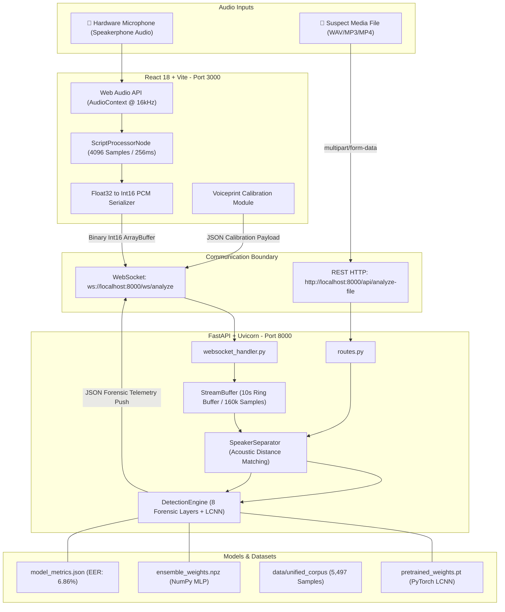

# 🔌 External Integrations, Protocols & Data Pipelines

> **System:** VoxSentinalX — Real-Time AI Voice Cloning & Deepfake Audio Detection  
> **Problem Statement ID:** SIH 26104 (Smart India Hackathon)  
> **System Version:** 2.0.0 (Comprehensive Multi-Vector Forensic & Deep Neural Suite)  
> **Repository Root:** [`p:/VoxSentinalX`](file:///p:/VoxSentinalX)  
> **Documentation Target:** `.planning/codebase/INTEGRATIONS.md`  

---

## 1. System Integration Architecture

VoxSentinalX operates as a real-time, low-latency client-server architecture designed to protect telephony users, call centers, and financial institutions from voice cloning impersonation attacks. It ingests audio through two primary avenues:
1. **Live Full-Duplex WebSocket Ingestion**: Continuous 16 kHz Int16 PCM streaming directly from the browser microphone via the Web Audio API.
2. **REST Multipart Batch Ingestion**: High-throughput file uploads supporting audio (`.wav`, `.mp3`, `.flac`, `.ogg`) and video (`.mp4`) forensics.



---

## 2. Audio I/O & Streaming Integrations

### 2.1 Browser Web Audio API & MediaDevices Ingestion
Audio ingestion on the client side is encapsulated in [`VoxSentinalAudioCapture`](file:///p:/VoxSentinalX/frontend/src/lib/audioCapture.ts#L3-L346):
* **Acoustic Hardware Access**: Uses `navigator.mediaDevices.getUserMedia()` with strict hardware constraint overrides:
  ```typescript
  const stream = await navigator.mediaDevices.getUserMedia({
    audio: {
      sampleRate: 16000,
      channelCount: 1,
      echoCancellation: false,  // CRITICAL: Prevent browser from canceling phone speakerphone audio
      noiseSuppression: false,  // CRITICAL: Retain vocal breath noise, tremors, and vocoder artifacts
      autoGainControl: true,
    },
  });
  ```
* **Audio Graph Construction**:
  - `AudioContext`: Initialized at `16000 Hz` native frequency.
  - `MediaStreamAudioSourceNode`: Ingests the microphone track.
  - `ScriptProcessorNode`: Instantiated with buffer size `4096` samples (corresponding to $4096 / 16000 = 256\text{ ms}$ per audio frame), single input, and single output channel.
  - `AnalyserNode`: Configured with `fftSize = 256` for real-time VU meter level feedback and visual oscilloscope rendering.
* **Int16 PCM Serialization**: Inside `onaudioprocess`, Float32 samples ($[-1.0, 1.0]$) are clamped and quantized to 16-bit signed integer PCM bytes:
  ```typescript
  const float32Data = event.inputBuffer.getChannelData(0);
  const int16Data = new Int16Array(float32Data.length);
  for (let i = 0; i < float32Data.length; i++) {
    const s = Math.max(-1, Math.min(1, float32Data[i]));
    int16Data[i] = s < 0 ? s * 0x8000 : s * 0x7FFF;
  }
  this.ws.send(int16Data.buffer); // Transmitted as binary ArrayBuffer
  ```

### 2.2 WebSocket Streaming Integration (`ws://localhost:8000/ws/analyze`)
Implemented in [`backend/app/api/websocket_handler.py`](file:///p:/VoxSentinalX/backend/app/api/websocket_handler.py#L13-L106):
* **Dual Binary / Text Frame Handling**:
  - **Binary Frames**: Contain raw Int16 PCM chunks ($8,192$ bytes for $4,096$ samples). Chunks are fed into [`StreamBuffer`](file:///p:/VoxSentinalX/backend/app/audio/stream_buffer.py#L8-L83).
  - **Text Frames (JSON)**: Carry control actions (`calibrate`, `reset`, `ping`).
* **Circular Buffer & Sliding Window Mechanics**:
  - `BUFFER_CAPACITY_SEC = 10.0` ($160,000$ samples in RAM): Overflows automatically discard oldest samples.
  - `WINDOW_DURATION_SEC = 2.0` ($32,000$ samples): Standard forensic analysis segment length.
  - `HOP_DURATION_SEC = 1.0` ($16,000$ samples): $50\%$ overlap between consecutive detection windows.
  - When $16,000$ new samples accumulate and total buffer $\ge 32,000$ samples, a window is extracted and dispatched to [`DetectionEngine.analyze_window()`](file:///p:/VoxSentinalX/backend/app/engine/fusion_scorer.py#L49-L160).
* **WebSocket Message Types**:
  1. **Server Welcome**: `CONNECTION_ESTABLISHED`
     ```json
     {
       "type": "CONNECTION_ESTABLISHED",
       "message": "VoxSentinalX Real-Time Forensic Audio Engine Ready",
       "config": {
         "sample_rate": 16000,
         "window_duration_sec": 2.0,
         "hop_duration_sec": 1.0
       }
     }
     ```
  2. **Client Reset**: `{"action": "reset"}` -> Clears circular buffer and EMA risk score history.
  3. **Client Ping**: `{"action": "ping"}` -> Returns `{"type": "PONG"}`.
  4. **Client Voice Calibration**: `{"action": "calibrate", "pcm_data": [0.012, -0.045, ...]}` -> Registers user voiceprint.
  5. **Server Telemetry Broadcast**: `ANALYSIS_UPDATE` pushed every 1.0 second.

### 2.3 REST Multipart File Ingestion (`POST /api/analyze-file`)
Implemented in [`backend/app/api/routes.py`](file:///p:/VoxSentinalX/backend/app/api/routes.py#L148-L264):
* **Supported Formats**: Uncompressed WAV (`audio/wav`), MP3 (`audio/mpeg`), FLAC (`audio/flac`), OGG (`audio/ogg`), and MP4 video recordings.
* **Decoding & Resampling Pipeline**:
  1. Upload bytes read in-memory via `io.BytesIO`.
  2. Decoded using `soundfile.read()`.
  3. Multi-channel audio collapsed to mono: `np.mean(data, axis=1)`.
  4. Resampled to 16,000 Hz if sample rate differs: `scipy.signal.resample(data, num_target_samples)`.
  5. Validates minimum duration threshold of $0.5$ seconds.
  6. Sliced into 2.0s sliding windows with 1.0s hop across entire duration. Audio shorter than 2.0s is symmetrically padded.
  7. Formulates complete diagnostic summary including `peak_risk_score`, `average_risk_score`, deduplicated anomalies, and time-stamped timeline.

---

## 3. Data & Model Integrations

### 3.1 Pre-Trained Weights & Model Assets
Located in [`backend/app/models/`](file:///p:/VoxSentinalX/backend/app/models/):

| Asset File | Size | Format / Architecture | Integration Role |
| :--- | :--- | :--- | :--- |
| [`pretrained_weights.pt`](file:///p:/VoxSentinalX/backend/app/models/pretrained_weights.pt) | **5.23 MB** (5,232,933 B) | PyTorch `state_dict` (`LCNNModel`) | Production deep neural network model combining 4-stage LCNN with Max-Feature-Map (MFM), BiLSTM context layer, and self-attention pooling. Ingests 80-bin Mel-Spectrograms. |
| [`archive_weights.pt`](file:///p:/VoxSentinalX/backend/app/models/archive_weights.pt) | **1.74 MB** (1,743,371 B) | PyTorch `state_dict` | Baseline convolutional weights checkpoint trained on initial ASVspoof 2017 partition. |
| [`ensemble_weights.npz`](file:///p:/VoxSentinalX/backend/app/models/ensemble_weights.npz) | **35.8 KB** (35,844 B) | NumPy compressed archive | Standalone lightweight Multi-Layer Perceptron (MLP, 32-64-32-2) trained with Focal Loss. Stores layer matrices (`W1`, `b1`, `W2`, `b2`, `W3`, `b3`) and standardization vectors (`mean`, `std`). |
| [`model_metrics.json`](file:///p:/VoxSentinalX/backend/app/models/model_metrics.json) | **363 B** | JSON benchmark metrics | Machine-readable benchmark telemetry documenting model accuracy, EER, and sample splits. |

### 3.2 Evaluation Benchmark Metrics (`model_metrics.json`)
```json
{
  "status": "trained",
  "trained_on_dataset": "VoxSentinalX Unified Corpus",
  "total_audio_samples": 5497,
  "bona_fide_samples": 2577,
  "synthetic_samples": 2920,
  "accuracy": 86.27,
  "equal_error_rate_eer": 6.86,
  "precision": 88.28,
  "recall": 86.99,
  "f1_score": 87.63,
  "best_val_loss": 0.3663,
  "updated_at": "2026-09-11 14:48:45"
}
```

### 3.3 Dataset Repositories & Storage Layout
Located in [`data/unified_corpus/`](file:///p:/VoxSentinalX/data/unified_corpus/):
* **Consolidated Size**: **1.45 GB** comprising **5,497 uncompressed 16 kHz audio files**.
* **Directory Partitioning**:
  - `data/unified_corpus/real/`: **2,577 files** of genuine human speech across physiological variants, local near-field recordings, and ASVspoof human subsets.
  - `data/unified_corpus/fake/`: **2,920 files** of synthesized speech generated across 13 distinct neural vocoder and TTS architectures.
* **Corpus Indexes & Catalogs**:
  - [`manifest.json`](file:///p:/VoxSentinalX/data/unified_corpus/manifest.json): Generator breakdown summary.
  - `trained_samples_inventory.csv` (766 KB): Detailed spreadsheet index with duration, sample rate, file size, class, generator type, and SHA256 hashes.
  - `trained_samples_inventory.json` (2.18 MB): Full machine-readable dataset catalog.
  - [`TRAINING_DATASET_INVENTORY.md`](file:///p:/VoxSentinalX/data/unified_corpus/TRAINING_DATASET_INVENTORY.md): Comprehensive markdown manifest.

### 3.4 Celebrity Reference Test Samples
Located in [`dataset_samples/`](file:///p:/VoxSentinalX/dataset_samples/):
Contains **14 high-fidelity master WAV files** (~340 MB total) of public figures used for live demonstration, calibration testing, and adversarial stress testing:
* `Andrew Tate.wav` (7.86 MB)
* `Barack Obama.wav` (8.45 MB)
* `Bill Gates.wav` (6.52 MB)
* `Donald Trump.wav` (4.21 MB)
* `Elon Musk.wav` (24.19 MB)
* `Greta Thunberg.wav` (8.45 MB)
* `Hillary Clinton.wav` (9.01 MB)
* `J.K. Rowling.wav` (16.12 MB)
* `Jensen Huang.wav` (20.16 MB)
* `Joe Biden.wav` (4.03 MB)
* `Kamala Harris.wav` (7.48 MB)
* `Mark Zuckerberg.wav` (63.35 MB)
* `Oprah Winfrey.wav` (16.89 MB)
* `Steve Jobs.wav` (149.48 MB)

---

## 4. Third-Party Speech Engines & Dataset Benchmarks

### 4.1 Synthesizer & Vocoder Architectures Covered
VoxSentinalX is explicitly engineered and trained to detect artifacts from leading commercial and open-source generative speech engines:

| Engine / Model Family | Architecture Category | Primary Forensic Artifact Captured |
| :--- | :--- | :--- |
| **OpenAI Voice Engine** | Autoregressive / Diffusion Neural Codec | High-frequency LFCC quantization, absent 8–12 Hz involuntary micro-tremor, synthetic spectral tilt. |
| **Coqui XTTS v2** | Multi-speaker Zero-Shot Latent Diffusion | Non-physical glottal flow velocity slope (NAQ deviation), unnatural syllable duration uniformity. |
| **ByteDance Seed-TTS** | High-fidelity Autoregressive Audio Codec | Static laryngeal jitter (<0.12%), phase coherence discontinuities in STFT unwrapping. |
| **Microsoft VALL-E / VoiceCraft** | Neural Audio Codec Token Concatenation | Discrete codebook transition boundary clicks, abrupt sub-band energy discontinuities. |
| **Meta VoiceBox** | Non-Autoregressive Continuous Normalizing Flow | Unnatural spectral flatness (>0.60 Wiener entropy), missing physiological inhalation pauses. |
| **ElevenLabs Synthesizer** | Proprietary Neural Vocoder & Prosody Model | Sterile Harmonic-to-Noise Ratio (>32 dB), absent quadratic phase coupling (QPC bicoherence <0.045). |
| **HiFi-GAN & BigVGAN** | Generative Adversarial Network (GAN) Vocoders | Harmonic phase inversion, sub-band checkerboard ripple artifacts at ~3.8 kHz. |
| **Grad-TTS & Diff-TTS** | Score-based Diffusion Models | Flat pitch contour with static fundamental frequency ($F_0$), diffuse stochastic noise floor. |
| **EnCodec / SoundStream** | Low-bitrate Residual Vector Quantization (RVQ) | Sharp brickwall filter cutoffs at 4.0 kHz and 8.0 kHz. |
| **IndicSynth (AI4Bharat)** | Indic-Dialect Multilingual Neural TTS | Tonal pitch inflection without neuromuscular micro-jitter across Indic languages. |

### 4.2 Benchmark Datasets & Harvester Integration
Configured in [`training/download_datasets.py`](file:///p:/VoxSentinalX/training/download_datasets.py#L33-L65):
* **ASVspoof 5 Challenge (2024 Track)**: International gold standard for synthetic voice anti-spoofing (`DynamicSuperb/SpoofDetection_ASVspoof2017`).
* **ASVspoof 2017 TTS Subsets**: Curated neural TTS evaluation corpus (`HaninZ/SpoofDetection_ASVspoof2017_TTS`).
* **IndicSynth Multilingual Benchmark**: 12 Indian languages (Hindi, Tamil, Telugu, Bengali, Marathi, etc.) covering regional accent cloning (`ai4bharat/indic-synthetic-speech`).
* **Local High-Capacity Deepfake Archive**: Integrated local archive (`K:\dataSet\archive`) containing 4,447 samples.
* **Automated Deduplicating Harvester**: Uses `huggingface_hub.hf_hub_download` and `pyarrow.parquet` to stream remote datasets, calculates SHA256 checksums to avoid duplicates, and normalizes audio into `data/unified_corpus`.

---

## 5. Network Protocols & API Endpoints

### 5.1 REST API Specification
Base URL: `http://localhost:8000/api`

#### `GET /api/health`
Checks backend operational status and enumerates active detector modules.
* **Request**: None
* **Response (200 OK)**:
  ```json
  {
    "status": "healthy",
    "project": "VoxSentinalX",
    "version": "2.0.0",
    "sample_rate_hz": 16000,
    "active_detectors": [
      "spectral", "prosody", "breathing", "acoustic_artifacts",
      "lfcc", "glottal", "perturbation", "bispectrum", "neural_lcnn"
    ],
    "total_forensic_layers": 9
  }
  ```

#### `GET /api/config`
Exposes active risk thresholds, detector fusion weightings, and smoothing parameters.
* **Request**: None
* **Response (200 OK)**:
  ```json
  {
    "sample_rate": 16000,
    "window_duration_sec": 2.0,
    "hop_duration_sec": 1.0,
    "risk_thresholds": {
      "low": 0.30,
      "moderate": 0.60,
      "high": 0.80
    },
    "detector_weights": {
      "spectral": 0.14,
      "prosody": 0.12,
      "breathing": 0.10,
      "acoustic_artifacts": 0.10,
      "lfcc": 0.16,
      "glottal": 0.12,
      "perturbation": 0.12,
      "bispectrum": 0.08,
      "neural_lcnn": 0.16
    },
    "ema_alpha": 0.35
  }
  ```

#### `POST /api/calibrate`
Registers near-field vocal fingerprint to isolate local user speech during speakerphone monitoring.
* **Request**: `Content-Type: application/json`
  ```json
  {
    "pcm_data": [0.002, -0.015, 0.034, 0.012, "..."]
  }
  ```
  *(Minimum length: 8,000 samples / 0.5s at 16 kHz)*
* **Response (200 OK)**:
  ```json
  {
    "status": "success",
    "message": "User voiceprint calibrated successfully",
    "profile": {
      "mean_energy": 0.0421,
      "spectral_centroid": 1845.32,
      "spectral_rolloff": 3450.0
    }
  }
  ```

#### `POST /api/analyze-file`
Uploads an audio or video recording for multi-layer forensic evaluation and timeline reconstruction.
* **Request**: `multipart/form-data` with form field `file: <binary media content>`
* **Response (200 OK)**:
  ```json
  {
    "filename": "suspicious_call.wav",
    "duration_seconds": 6.5,
    "total_windows_analyzed": 5,
    "overall_verdict": "CRITICAL_AI_CLONE",
    "risk_level": "CRITICAL",
    "average_risk_score": 0.842,
    "peak_risk_score": 0.915,
    "recommendation": "🚨 HIGH RISK: DO NOT authorize financial transfers...",
    "suggested_actions": [
      "Request caller to perform out-of-band mobile OTP verification",
      "Terminate call and dial the contact's official verified number",
      "Ask unpredictable challenge questions",
      "Flag call and export forensic telemetry log"
    ],
    "unique_anomalies_detected": [
      {
        "type": "SPECTRAL_SMOOTHNESS",
        "severity": "HIGH",
        "metric_name": "Spectral Flatness",
        "value": 0.724,
        "threshold": "> 0.60 (Human speech: 0.05 - 0.45)",
        "description": "Voice spectrum exhibits unnatural flatness characteristic of neural vocoder synthesis.",
        "source_detector": "spectral"
      },
      {
        "type": "STATIC_LARYNGEAL_JITTER",
        "severity": "HIGH",
        "metric_name": "Laryngeal Cycle-to-Cycle Jitter",
        "value": "0.082%",
        "threshold": "< 0.12% (Biological human vocal cords: 0.25% - 1.10%)",
        "description": "Vocal pitch period micro-fluctuation is mathematically static.",
        "source_detector": "perturbation"
      }
    ],
    "timeline": [
      {
        "window_index": 1,
        "timestamp": "00:00",
        "timestamp_sec": 0.0,
        "risk_score": 0.812,
        "raw_risk_score": 0.812,
        "is_spike": false,
        "risk_level": "CRITICAL",
        "alert_type": "IMMEDIATE_ACTION_REQUIRED",
        "layer_scores": {
          "spectral": 0.85,
          "prosody": 0.78,
          "breathing": 0.40,
          "acoustic_artifacts": 0.80,
          "lfcc": 0.88,
          "glottal": 0.75,
          "perturbation": 0.90,
          "bispectrum": 0.82,
          "neural_lcnn": 0.89
        }
      }
    ]
  }
  ```

#### `GET /api/training/datasets`
Returns local installation status and sample counts for deepfake speech benchmark catalogs.

#### `GET /api/training/metrics`
Returns current model accuracy, EER, precision, recall, and training dataset metadata.

#### `POST /api/training/generate-corpus`
Triggers generation of synthetic adversarial voice samples (`num_samples` parameter).

#### `POST /api/training/train`
Dispatches background model training job (`epochs`, `batch_size`, `lr`, `data_dir` parameters).

---

### 5.2 WebSocket Telemetry Payload Structure (`ws://localhost:8000/ws/analyze`)
Every 1.0 second, the server emits an `ANALYSIS_UPDATE` JSON message:

```json
{
  "type": "ANALYSIS_UPDATE",
  "window_index": 14,
  "timestamp": "00:14",
  "timestamp_sec": 14.0,
  "risk_score": 0.865,
  "raw_risk_score": 0.892,
  "is_spike": false,
  "risk_level": "CRITICAL",
  "alert_type": "IMMEDIATE_ACTION_REQUIRED",
  "status_text": "High probability of AI-generated / cloned voice detected",
  "user_message": "🛑 CRITICAL ALERT: Voice analysis indicates strong probability of AI synthesis or deepfake cloning. Multiple spectral, glottal inverse filtering, and deep neural signatures detected.",
  "recommendation": "🚨 HIGH RISK: DO NOT authorize any financial transfers, credential releases, or sensitive operations. Initiate immediate out-of-band verification via registered callback.",
  "suggested_actions": [
    "Request caller to perform out-of-band mobile OTP verification",
    "Terminate call and dial the contact's official verified number",
    "Ask unpredictable challenge questions (e.g. 'What did you have for lunch yesterday?')",
    "Flag call and export forensic telemetry log for security review"
  ],
  "diagnostics": [
    {
      "type": "ABSENT_QUADRATIC_PHASE_COUPLING",
      "severity": "HIGH",
      "metric_name": "Higher-Order Bicoherence (QPC)",
      "value": 0.0215,
      "threshold": "< 0.045 (Natural human vocal tract: 0.075 - 0.350)",
      "description": "Bispectral analysis shows absence of non-linear aerodynamic quadratic phase coupling between vocal harmonics.",
      "source_detector": "bispectrum"
    },
    {
      "type": "GLOTTAL_BIOMECHANICAL_DEVIATION",
      "severity": "HIGH",
      "metric_name": "Glottal Normalized Amplitude Quotient (NAQ)",
      "value": 0.0412,
      "threshold": "Biological human range: 0.060 - 0.280",
      "description": "Inverse LPC filtering reveals non-physical glottal flow velocity slope. Excitation pulse violates human laryngeal aerodynamic boundaries.",
      "source_detector": "glottal"
    }
  ],
  "layer_scores": {
    "spectral": 0.78,
    "prosody": 0.82,
    "breathing": 0.90,
    "acoustic_artifacts": 0.65,
    "lfcc": 0.88,
    "glottal": 0.84,
    "perturbation": 0.91,
    "bispectrum": 0.85,
    "neural_lcnn": 0.89
  },
  "layer_metrics": {
    "spectral": {
      "spectral_flatness": 0.682,
      "hnr_db": 34.5,
      "phase_coherence": 0.22,
      "hf_energy_ratio": 0.312
    },
    "prosody": {
      "pitch_mean_hz": 142.3,
      "pitch_std_hz": 6.8,
      "micro_tremor_index": 0.018,
      "voiced_fraction": 0.88
    },
    "breathing": {
      "breath_events_detected": 0,
      "continuous_speech_sec": 11.5,
      "pause_fraction": 0.03
    },
    "glottal": {
      "naq_mean": 0.0412,
      "lpc_residual_kurtosis": 0.95,
      "frames_analyzed": 58
    },
    "perturbation": {
      "jitter_local_percent": 0.078,
      "shimmer_local_percent": 0.82,
      "rap_jitter": 0.062,
      "apq3_shimmer": 0.75,
      "cycles_analyzed": 112
    },
    "bispectrum": {
      "mean_bicoherence": 0.0215,
      "peak_qpc_score": 0.0642,
      "frames_evaluated": 62
    },
    "neural_lcnn": {
      "neural_spoof_prob": 0.892,
      "model_architecture": "LCNN-BiLSTM-Attention",
      "custom_trained_weights": true
    }
  },
  "speaker_separation": {
    "caller_ratio": 0.94,
    "user_ratio": 0.06,
    "calibrated": true
  }
}
```

---

## 6. Security, CORS & Network Boundaries

### 6.1 Cross-Origin Resource Sharing (CORS) Configuration
Defined in [`backend/app/main.py`](file:///p:/VoxSentinalX/backend/app/main.py#L24-L31):
```python
app.add_middleware(
    CORSMiddleware,
    allow_origins=settings.CORS_ORIGINS,  # Default: ["*"]
    allow_credentials=True,
    allow_methods=["*"],
    allow_headers=["*"],
)
```
* **Production Boundary**: In production deployments, `CORS_ORIGINS` is configured via environment variable `VOXSENTINALX_CORS_ORIGINS='["http://localhost:3000", "https://voxsentinal.local"]'` to restrict API access exclusively to trusted frontend dashboard domains.

### 6.2 Data Privacy & Ephemeral In-Memory Buffering (Zero Disk Persistence)
* **Zero Audio Persistence**: Live incoming phone call PCM chunks streamed over WebSocket reside strictly in volatile circular memory ([`StreamBuffer._buffer`](file:///p:/VoxSentinalX/backend/app/audio/stream_buffer.py#L26)).
* **No Disk Writes**: Audio frames are discarded immediately after feature extraction and rolling buffer expiration. No conversational audio is ever written to disk, databases, or cloud buckets during monitoring, fully complying with banking secrecy standards and data protection regulations (e.g. GDPR, DPDP Act 2023).
* **Temporary File Handling**: Media files uploaded to `/api/analyze-file` are held in memory as `io.BytesIO` streams and garbage-collected upon response completion.

### 6.3 Acoustic Isolation & Voiceprint Calibration (Near-Field vs Far-Field)
* **Problem Addressed**: During phone speakerphone calls, the local user's own speech is captured by the PC microphone alongside the incoming caller's voice. Evaluating both together causes false alarms when the user speaks naturally or masks synthetic caller traits.
* **Mechanism**: [`SpeakerSeparator`](file:///p:/VoxSentinalX/backend/app/audio/speaker_separator.py#L7-L125) compares 50ms frames against a calibrated user voiceprint:
  - Measures near-field RMS energy ($\ge 2\times$ higher than acoustic speakerphone propagation).
  - Matches spectral centroid and spectral rolloff ($85\%$ energy frequency boundary).
  - Frames scoring $>0.70$ similarity with the user profile are isolated and excluded from the caller forensic analysis window.

### 6.4 Risk Classification Decision Boundaries
Configured in [`backend/app/core/config.py`](file:///p:/VoxSentinalX/backend/app/core/config.py#L31-L36):

| Risk Score Range | Severity Classification | Alert State | Recommended Operational Policy |
| :--- | :--- | :--- | :--- |
| **$0.00 - 0.30$** | `LOW` | `NORMAL` | Natural human speech verified. Normal conversation permitted. |
| **$0.30 - 0.60$** | `MODERATE` | `CAUTION` | Acoustic irregularities observed (potential cellular codec compression or low-tier voice cloning). Heightened vigilance advised. |
| **$0.60 - 0.80$** | `HIGH` | `WARNING` | Significant synthetic anomalies (monotone pitch, LFCC high-frequency distortion, static jitter). Verify caller identity before sensitive disclosures. |
| **$0.80 - 1.00$** | `CRITICAL` | `IMMEDIATE_ACTION_REQUIRED` | Strong evidence of AI cloning. Immediate freeze on financial transactions; enforce out-of-band verification. |

### 6.5 Voice Swap & Rapid Velocity Spike Detection
* **Threat Model**: An attacker initiates a phone call using a genuine human accomplice, then swaps audio to an AI voice clone mid-call once trust is established.
* **Countermeasure**: The fusion engine calculates risk velocity:
  $$\Delta = \text{raw\_score}_t - \text{smoothed\_score}_{t-1}$$
  If $\Delta \ge 0.28$ within a single 1.0-second hop, the system raises a critical `VOICE_SWAP_EVENT` alert, warning the operator of dynamic speaker takeover.
