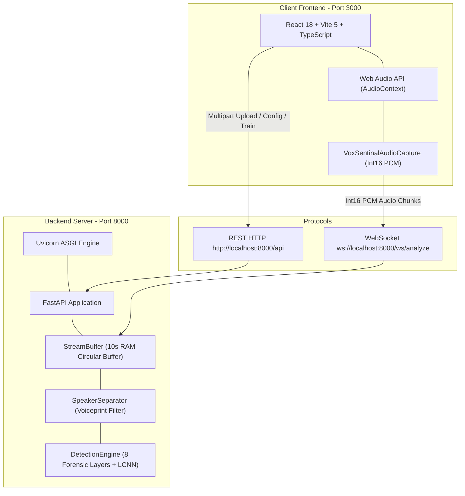

# 🛠️ Technology Stack & System Specifications

> **System:** VoxSentinalX — Real-Time AI Voice Cloning & Deepfake Audio Detection  
> **Problem Statement ID:** SIH 26104 (Smart India Hackathon)  
> **System Version:** 2.0.0 (Comprehensive Multi-Vector Forensic & Deep Neural Suite)  
> **Repository Root:** [`p:/VoxSentinalX`](file:///p:/VoxSentinalX)  
> **Documentation Target:** `.planning/codebase/STACK.md`  

---

## 1. Executive Technology Summary

VoxSentinalX is engineered with a decoupled, high-performance architecture comprising:
1. **Asynchronous Real-Time Backend**: Built in **Python 3.9+** utilizing **FastAPI**, **Uvicorn**, **WebSockets**, **NumPy**, **SciPy**, and **PyTorch (LCNN-BiLSTM-Attention)** for sub-20ms multi-vector forensic signal processing.
2. **Cybernetic Single-Page Frontend**: Built in **TypeScript**, **React 18**, **Vite 5**, and **Tailwind CSS 3**, directly ingesting microphone streams via the browser **Web Audio API** and rendering dynamic oscilloscopes, 8-axis forensic radar charts, and emergency countermeasure feeds.
3. **Automated Cross-Platform Tooling**: Windows batch launchers (`run_all.bat`, `start_backend.bat`, `start_frontend.bat`, `run_tests.bat`) for one-click deployment and automated test suite execution.



---

## 2. Backend Technology Stack

The backend code is primarily located in [`backend/app/`](file:///p:/VoxSentinalX/backend/app/) with dependencies defined in [`backend/requirements.txt`](file:///p:/VoxSentinalX/backend/requirements.txt).

### 2.1 Core Runtime & Server Framework
* **Python Runtime**: Python 3.9+ (Production baseline tested on Python 3.10.x and 3.11.x, 64-bit CPython).
* **FastAPI (`>=0.110.0`)**: Modern, high-performance web framework providing native async/await syntax, OpenAPI 3.0 (Swagger UI at `/docs` and ReDoc at `/redoc`), robust dependency injection, and automatic Pydantic request/response serialization.
* **Uvicorn (`>=0.28.0`)**: Production ASGI (Asynchronous Server Gateway Interface) web server powering the FastAPI event loop with uvloop/asyncio compatibility.
* **WebSockets (`>=12.0`)**: Native RFC 6455 compliant WebSocket protocol library handling bidirectional real-time audio chunk transmission and state synchronization.
* **HTTPX (`>=0.27.0`)**: Next-generation asynchronous HTTP client used for automated integration testing (`TestClient`) and remote dataset harvesting from Hugging Face Hub.
* **Python-Multipart (`>=0.0.9`)**: Streaming multipart parser handling non-blocking file uploads (`POST /api/analyze-file`).
* **Pydantic (`>=2.6.0`) & Pydantic-Settings (`>=2.2.0`)**: Strict schema validation and hierarchical settings management via [`Settings`](file:///p:/VoxSentinalX/backend/app/core/config.py#L6-L61) with environment variable override support (`VOXSENTINALX_` prefix).

### 2.2 Digital Signal Processing (DSP) & Math Libraries
* **NumPy (`>=1.26.0`)**: Foundational vector math engine powering array operations, N-dimensional slicing, PCM Int16-to-Float32 normalization, FFT calculations, and the standalone [`NeuralForensicEnsemble`](file:///p:/VoxSentinalX/training/train_acoustic_ensemble.py#L132-L210) MLP classifier.
* **SciPy (`>=1.12.0`)**: Primary mathematical and DSP engine:
  - `scipy.signal.welch`: High-resolution Power Spectral Density (PSD) estimation for spectral flatness and 8–12 Hz involuntary micro-tremor analysis.
  - `scipy.signal.stft` / `scipy.signal.istft`: Short-Time Fourier Transform computation for unwrapped STFT phase coherence and 2D Bispectrum bicoherence.
  - `scipy.signal.correlate`: Fast cross-correlation and autocorrelation for pitch ($F_0$) period estimation, Harmonic-to-Noise Ratio (HNR), and lag discovery.
  - `scipy.signal.butter` & `scipy.signal.sosfilt`: Digital Butterworth filtering and second-order sections (SOS) for lowpass filtering fundamental frequencies and detecting sharp brickwall vocoder roll-offs.
  - `scipy.signal.find_peaks`: Cycle-by-cycle pitch pulse localization for cycle-to-cycle perturbation analysis (Jitter and Shimmer).
  - `scipy.signal.hilbert`: Analytic signal calculation for envelope extraction during prosodic cadence modeling.
  - `scipy.linalg.solve_toeplitz`: Solves the Levinson-Durbin autocorrelation equation for Linear Predictive Coding (LPC) inverse filtering in glottal flow extraction.
  - `scipy.fftpack.dct`: Discrete Cosine Transform (DCT-II) for generating static Linear Frequency Cepstral Coefficients (LFCC).
* **SoundFile (`>=0.12.1`)**: Python wrapper around `libsndfile` providing zero-copy audio I/O for WAV, FLAC, OGG, and MP3 formats.
* *Clarification on Librosa*: The system intentionally implements native DSP routines in pure SciPy/NumPy instead of relying on the heavy `librosa` package. This eliminates Python runtime overhead, drops cold-start latency, and ensures sub-20ms sliding-window analysis on standard CPUs.

### 2.3 Deep Learning & Neural Network Framework
* **PyTorch (`torch >=2.2.0`)**: Core deep learning tensor framework powering the [`LCNNModel`](file:///p:/VoxSentinalX/backend/app/models/lcnn_architecture.py#L53-L116) network:
  - Custom Max-Feature-Map (MFM) non-linear activation layers ([`MaxFeatureMap2D`](file:///p:/VoxSentinalX/backend/app/models/lcnn_architecture.py#L7-L16) and `MaxFeatureMap1D`).
  - 4-Stage 2D Convolutional Front-End with adaptive frequency-axis pooling (`AdaptiveAvgPool2d((8, None))`).
  - Bidirectional LSTM (`nn.LSTM(input_size=512, hidden_size=64, bidirectional=True)`) for temporal artifact modeling.
  - Self-Attention Pooling ([`SelfAttentionPooling`](file:///p:/VoxSentinalX/backend/app/models/lcnn_architecture.py#L35-L51)) over variable temporal frame lengths.
  - Linear classifier with Dropout (`p=0.3`) outputting 2-class logits (Genuine vs Synthetic).
* **Torchaudio (`>=2.2.0`)**: High-performance audio I/O and tensor transform operations.
* **Hugging Face Hub (`huggingface_hub >=0.20.0`)**: Programmatic dataset search, cataloging, and direct streaming from HF model repos.
* **PyArrow (`pyarrow >=14.0.0`)**: High-throughput Apache Parquet dataset reader used by [`download_datasets.py`](file:///p:/VoxSentinalX/training/download_datasets.py#L24-L32) to ingest parquet-partitioned speech benchmarks.
* **ONNX Export Engine**: PyTorch built-in `torch.onnx.export` (opset 14) configured in [`export_onnx.py`](file:///p:/VoxSentinalX/training/export_onnx.py) with dynamic batch and time dimensions for deployment to ONNX Runtime / Triton Inference Server.

### 2.4 Testing Framework
* **Pytest (`>=8.0.0`)**: Test framework running all unit and integration tests located in [`tests/`](file:///p:/VoxSentinalX/tests/).
* **Pytest-Asyncio (`>=0.23.0`)**: Asynchronous test fixtures enabling full-duplex WebSocket stream simulation and FastAPI async route testing.

---

## 3. Frontend Technology Stack

The frontend is an ultra-responsive cyber-themed Single Page Application located in [`frontend/`](file:///p:/VoxSentinalX/frontend/).

### 3.1 Core Client Framework & Languages
* **Runtime**: Node.js 18.x / 20.x LTS with `npm` (v9.x or v10.x).
* **Language**: TypeScript 5.6.3 ([`frontend/tsconfig.json`](file:///p:/VoxSentinalX/frontend/tsconfig.json)) configured with:
  - `target`: `ES2020`
  - `module`: `ESNext`
  - `moduleResolution`: `bundler`
  - `jsx`: `react-jsx`
  - `strict`: `true`
* **UI Framework**: React 18.3.1 & React DOM 18.3.1 ([`frontend/package.json`](file:///p:/VoxSentinalX/frontend/package.json)).
* **Build Bundler**: Vite 5.4.11 ([`frontend/vite.config.ts`](file:///p:/VoxSentinalX/frontend/vite.config.ts)) with `@vitejs/plugin-react` (4.3.4):
  - Local dev server on port `3000` with `host: true`.
  - Production build targets `dist/` with tree shaking and chunk minimization.

### 3.2 UI Design System & Component Tooling
* **Tailwind CSS (`3.4.16`)**: Utility-first CSS framework configured with custom cybernetic aesthetics ([`frontend/tailwind.config.js`](file:///p:/VoxSentinalX/frontend/tailwind.config.js)):
  - Extended color palette: `cyber-dark` (`#070a10`), `cyber-base` (`#0a0d14`), `cyber-card` (`#0f1422`), `cyber-accent` / cyan (`#06b6d4`), `cyber-neon` / emerald (`#10b981`), `cyber-warning` / amber (`#f59e0b`), `cyber-danger` / crimson (`#ef4444`).
  - Keyframe animations: `pulseGlow`, `radarSweep`, `shimmer`, `scanline`, and `float`.
  - Custom neon box shadows: `neon-cyan`, `neon-emerald`, `neon-crimson`, and `neon-amber`.
  - Dark mode support toggled via `darkMode: 'class'`.
* **PostCSS (`8.4.49`) & Autoprefixer (`10.4.20`)**: Cross-browser CSS transformation and automated vendor prefixing.
* **Lucide React (`0.468.0`)**: Modern SVG icon library for cybersecurity glyphs, shields, waveform indicators, and status badges.
* **Utility Libraries**:
  - `clsx` (`2.1.1`): Dynamic CSS class construction.
  - `tailwind-merge` (`2.5.5`): Efficient utility class deduplication and precedence merging.

### 3.3 Audio Processing & Visualizer Web APIs
* **Web Audio API (`window.AudioContext`)**:
  - Native browser audio graph operating at 16,000 Hz.
  - `MediaStreamAudioSourceNode`: Ingests live hardware microphone stream.
  - `ScriptProcessorNode` (buffer size `4096` samples = 256 ms per chunk): Intercepts Float32 audio samples and performs in-browser quantization to Int16 PCM byte arrays.
  - `AnalyserNode` (`fftSize = 256`): Extracts frequency bin data for real-time VU audio meter bars and canvas waveforms.
* **MediaDevices API (`navigator.mediaDevices.getUserMedia`)**:
  - Acoustic capture configured to bypass browser echo cancellation and noise suppression (`echoCancellation: false`, `noiseSuppression: false`), preserving speakerphone audio clarity.
* **HTML5 Canvas & SVG Rendering**:
  - Custom 8-axis SVG radar visualization ([`ForensicRadar.tsx`](file:///p:/VoxSentinalX/frontend/src/components/ForensicRadar.tsx)).
  - Radial SVG threat gauge ([`RiskGauge.tsx`](file:///p:/VoxSentinalX/frontend/src/components/RiskGauge.tsx)).
  - Canvas time-domain oscilloscope ([`audioVisualizer.ts`](file:///p:/VoxSentinalX/frontend/src/lib/audioVisualizer.ts)).

---

## 4. Build Tools, Runners & Environment Setup

The repository provides modular scripts to launch components individually or as an integrated system:

| Script / Tool | Location | Working Directory | Command Executed | Purpose |
| :--- | :--- | :--- | :--- | :--- |
| **Integrated Launcher** | [`run_all.bat`](file:///p:/VoxSentinalX/run_all.bat) | Root (`p:\VoxSentinalX`) | `start ... python run.py`<br>`start ... npm run dev` | Launches FastAPI backend (Port 8000) and React frontend (Port 3000) concurrently in two independent CMD windows. |
| **Backend Launcher** | [`start_backend.bat`](file:///p:/VoxSentinalX/start_backend.bat) | `backend/` | `python run.py` | Starts Uvicorn server on `0.0.0.0:8000` with hot-reload enabled. |
| **Frontend Launcher** | [`start_frontend.bat`](file:///p:/VoxSentinalX/start_frontend.bat) | `frontend/` | `npm run dev` | Runs Vite development server on `http://localhost:3000`. |
| **Automated Test Runner** | [`run_tests.bat`](file:///p:/VoxSentinalX/run_tests.bat) | Root (`p:\VoxSentinalX`) | `python -m pytest tests/ -v` | Runs all 20 automated unit and integration tests with verbose reporting. |
| **Model Trainer** | [`training/train_acoustic_ensemble.py`](file:///p:/VoxSentinalX/training/train_acoustic_ensemble.py) | Root / `training/` | `python training/train_acoustic_ensemble.py` | Extracts 32D forensic features across all 5,497 corpus samples and trains MLP with Focal Loss. |
| **Adversarial Voice Generator** | [`training/generate_advanced_ai_voices.py`](file:///p:/VoxSentinalX/training/generate_advanced_ai_voices.py) | Root / `training/` | `python training/generate_advanced_ai_voices.py` | Synthesizes HiFi-GAN, Diffusion, Zero-Shot, Brickwall, and Indic voice clone samples into `data/unified_corpus`. |
| **Inventory Generator** | [`training/generate_sample_inventory.py`](file:///p:/VoxSentinalX/training/generate_sample_inventory.py) | Root / `training/` | `python training/generate_sample_inventory.py` | Generates CSV, JSON, and Markdown manifests with SHA256 hashes for all corpus files. |
| **ONNX Exporter** | [`training/export_onnx.py`](file:///p:/VoxSentinalX/training/export_onnx.py) | Root / `training/` | `python training/export_onnx.py` | Exports PyTorch LCNN model to ONNX format. |

### 4.1 Python Environment & Dependency Installation
```cmd
# Create virtual environment (optional if using system python)
python -m venv .venv
.venv\Scripts\activate

# Install backend dependencies
pip install -r backend/requirements.txt
```

### 4.2 Frontend Node.js Environment Setup
```cmd
cd frontend
npm install
npm run build   # Verifies TypeScript types via 'tsc' and outputs production bundle
```

---

## 5. System Requirements & Hardware Specifications

### 5.1 Operating System Compatibility
* **Primary / Recommended**: **Windows 10 / Windows 11 (64-bit)** with PowerShell 5.1+ or CMD. All `.bat` automated launchers are natively built for Windows.
* **Linux Compatibility**: Fully compatible with Linux (Ubuntu 20.04/22.04 LTS, Debian 11/12, Fedora 38+). Backend runs natively via `python backend/run.py` and frontend via `npm run dev`.
* **macOS Compatibility**: Compatible with macOS 12+ (Monterey, Ventura, Sonoma) on Apple Silicon (M1/M2/M3) and Intel CPUs.

### 5.2 Hardware Specifications
* **Central Processing Unit (CPU)**:
  - *Minimum*: Quad-core x86_64 or ARM64 processor (Intel Core i5 8th Gen / AMD Ryzen 5 2000+ or Apple M1).
  - *Recommended*: 8-core CPU (Intel Core i7 11th Gen+ / AMD Ryzen 7 5000+).
  - *Inference Latency*: Real-time sliding window analysis consumes ~12ms–18ms CPU compute per 2.0-second window, leaving ample headroom on standard consumer hardware.
* **Random Access Memory (RAM)**:
  - *Minimum*: 8 GB DDR4/DDR5 system RAM (sufficient for live WebSocket streaming and file analysis).
  - *Recommended*: 16 GB+ system RAM (recommended for in-memory batch feature extraction during complete model retraining on 5,497 files).
* **Graphics Processing Unit (GPU)**:
  - *Default Mode*: **CPU Execution**. The forensic DSP suite and LCNN inference run entirely on CPU without requiring CUDA.
  - *Optional Acceleration*: NVIDIA GPU with CUDA 11.8 or 12.1+. PyTorch will automatically bind to CUDA devices if `torch.cuda.is_available()` is true.
* **Storage Space**:
  - *Repository & Code*: ~25 MB.
  - *Unified Forensic Corpus* ([`data/unified_corpus`](file:///p:/VoxSentinalX/data/unified_corpus)): ~1.45 GB (5,497 uncompressed 16 kHz audio files).
  - *Celebrity Evaluation Samples* ([`dataset_samples`](file:///p:/VoxSentinalX/dataset_samples)): ~340 MB (14 uncompressed high-fidelity master WAV files).
  - *Node Modules & Python Wheels*: ~800 MB.
  - *Total Free Disk Space Required*: **Minimum 3.0 GB free SSD/HDD storage**.

### 5.3 Audio Hardware & Acoustic Setup
* **Microphone Input**:
  - Laptop built-in microphone array or external USB studio microphone.
  - Minimum hardware sample rate support: 16,000 Hz (44.1 kHz and 48 kHz hardware interfaces are automatically resampled by browser Web Audio API to 16 kHz).
  - Recommended Physical Setup: Phone placed in **Speakerphone Mode** within 10 cm to 30 cm of laptop microphone.
* **Audio Output**:
  - Standard internal speakers or external headphones for audio file preview and alert sound effects.

### 5.4 Browser Requirements
* **Recommended Browsers**:
  - **Google Chrome** (v110+)
  - **Microsoft Edge** (v110+)
  - **Brave Browser** (v1.50+)
  - **Mozilla Firefox** (v115+ ESR / Release)
* **Required Browser Capabilities**:
  - Full support for `window.AudioContext` or `webkitAudioContext`.
  - Permission granted for `navigator.mediaDevices.getUserMedia({ audio: true })`.
  - Full WebSocket RFC 6455 support (`new WebSocket()`).
  - Web Workers and HTML5 Canvas API support.
