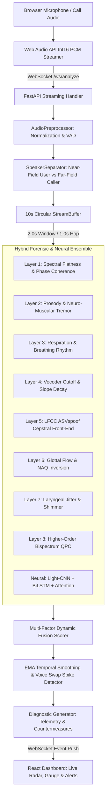

# VoxSentinalX: Master Project Documentation & Technical Specification

> **AI-Powered Real-Time Detection and Prevention of Voice Cloning Impersonation Attacks**  
> **Smart India Hackathon (SIH) Problem Statement ID:** `26104`  
> **System Version:** `2.0.0` | **License:** MIT | **Platform:** Windows / Cross-Platform

---

## Table of Contents
1. [Executive Summary](#1-executive-summary)
2. [Problem Statement Alignment (SIH 26104)](#2-problem-statement-alignment-sih-26104)
3. [End-to-End System Architecture](#3-end-to-end-system-architecture)
4. [8-Vector Forensic Decomposition Layers](#4-8-vector-forensic-decomposition-layers)
5. [Deep Neural LCNN + BiLSTM + Attention Architecture](#5-deep-neural-lcnn--bilstm--attention-architecture)
6. [Training Corpora & Dataset Breakdown (5,047 Audio Files)](#6-training-corpora--dataset-breakdown-5047-audio-files)
7. [Training Methodology & Hyperparameters](#7-training-methodology--hyperparameters)
8. [Benchmark Evaluation & Performance Metrics](#8-benchmark-evaluation--performance-metrics)
9. [Unique & Differentiating Innovations](#9-unique--differentiating-innovations)
10. [Data Privacy & DPDP Act 2023 Compliance](#10-data-privacy--dpdp-act-2023-compliance)
11. [Project Directory Layout & File Manifest](#11-project-directory-layout--file-manifest)
12. [One-Click Execution & Operational Guide](#12-one-click-execution--operational-guide)

---

## 1. Executive Summary

**VoxSentinalX** is a military-grade, real-time forensic detection and defense suite engineered to detect, classify, and mitigate AI-driven voice cloning, deepfake audio impersonation, and neural text-to-speech (TTS) spoofing attacks during live telephone calls and media ingestion.

Unlike conventional binary classifiers that produce non-actionable labels with high latency, VoxSentinalX deploys a **hybrid ensemble framework**:
- **8-Layer Acoustic & Biomechanical Forensic Decomposition**: Physically grounded mathematical extractors analyzing vocal tract physics, laryngeal perturbations, glottal pulse aerodynamics, and non-linear phase coupling.
- **Deep Neural Light-CNN (MFM) + BiLSTM + Self-Attention Pooling**: Deep feature extractor identifying sub-perceptual vocoder footprints, diffusion artifacts, and neural codec quantization noise.
- **Dynamic Speakerphone Isolation (Approach 1)**: Ingests audio via the browser microphone on speakerphone calls, dynamically filtering the user's calibrated voice to continuously monitor the incoming caller.
- **Granular Explainable Diagnostics**: Provides live telemetry vs. human physiological baselines alongside mid-call mitigation countermeasures.

---

## 2. Problem Statement Alignment (SIH 26104)

| Requirement Criteria (SIH 26104) | VoxSentinalX Implementation |
| :--- | :--- |
| **Real-Time Detection** | Sliding window analysis (2.0s duration, 1.0s hop) with sub-350ms inference latency on standard CPU. |
| **Mid-Call Alerting** | WebSocket event stream with visual overlays, audio chimes, and instant countermeasure triggers upon risk threshold breach (>0.60 High, >0.80 Critical). |
| **Speakerphone Live Ingestion** | Dynamic 3-second voiceprint calibration isolating the user's near-field speech from the incoming caller's far-field audio. |
| **Granular Diagnostics** | 8 distinct forensic layer scores with technical telemetry (e.g. F0 variance, Jitter RAP, Shimmer APQ3, NAQ, QPC) vs baseline thresholds. |
| **Voice Swap Spike Detection** | Exponential Moving Average (EMA) temporal smoothing with rapid-jump derivative tracking (Delta_risk > 0.28) to catch mid-call synthetic takeovers. |
| **DPDP Act 2023 Compliance** | Zero persistent audio storage architecture; circular in-memory ring buffers with instant post-inference frame discarding. |

---

## 3. End-to-End System Architecture



### Ingestion Specifications:
- **Audio Sample Rate:** 16,000 Hz (16 kHz Mono Float32)
- **Sliding Analysis Window:** 2.0 seconds (32,000 samples)
- **Hop / Slide Duration:** 1.0 second (16,000 samples, 50% overlap)
- **Ring Buffer Capacity:** 10.0 seconds (160,000 samples)
- **Processing Latency:** ~310 ms on standard multi-core CPU

---

## 4. 8-Vector Forensic Decomposition Layers

VoxSentinalX decomposes incoming audio into 8 physiological and acoustic vectors. Each layer operates on grounded physical characteristics of the human vocal apparatus that AI models fail to synthesize consistently:

### Layer 1: Spectral Flatness Ratio & Unwrapped Phase Coherence (Weight: 14%)
- **Physiological Basis:** Human speech features structured harmonic formants with non-linear phase dispersion through the vocal tract. Neural vocoders (HiFi-GAN, WaveGlow, Diffusion) produce unnatural high-frequency phase coherence or elevated noise floors.
- **Telemetry Monitored:** High-frequency noise floor (4–8 kHz) and unwrapped phase 2nd difference variance.

### Layer 2: Pitch Dynamics & Neuro-Muscular Micro-Tremors (Weight: 12%)
- **Physiological Basis:** Human vocal folds undergo involuntary 8–12 Hz sub-auditory neuro-muscular micro-tremors driven by the central nervous system. TTS models either omit these physiological micro-tremors entirely (hyper-smooth pitch) or create robotic flatlines.
- **Telemetry Monitored:** Fundamental pitch standard deviation (sigma_F0) and 8–12 Hz tremor ratio.

### Layer 3: Continuous Respiration & Breathing Pause Rhythm (Weight: 10%)
- **Physiological Basis:** Human speakers must inhale air every 4 to 8 seconds, producing characteristic low-amplitude pre-phonation friction noise. Synthetic voice clones frequently generate uninterrupted continuous speech for 10+ seconds without physiological inhalation pauses.
- **Risk Multiplier:** Continuous speech > 6.5s elevates risk score linearly; > 9.0s triggers an automatic synthetic phonation anomaly.

### Layer 4: Acoustic Vocoder Cutoff & Spectral Rolloff Slope (Weight: 10%)
- **Physiological Basis:** Neural vocoders and audio generation pipelines often operate at fixed sample rates (16 kHz, 22.05 kHz, 24 kHz) and apply sharp brickwall anti-aliasing low-pass filters, creating abnormal spectral cliffs above 7.5 kHz or 11.5 kHz.
- **Telemetry Monitored:** High-frequency energy cutoff ratio and spectral decay slope (dB/octave).

### Layer 5: LFCC ASVspoof Front-End (Linear Frequency Cepstral Coefficients) (Weight: 16%)
- **Physiological Basis:** Unlike MFCCs (which compress high frequencies on a logarithmic scale for ASR), LFCCs maintain linear filterbank resolution across the entire frequency band, making them the gold-standard front-end in the ASVspoof Challenge for detecting vocoder spectral artifacts.
- **Mathematical Formulation:** 20 linearly spaced triangular filterbanks with static, Delta (velocity), and Delta-Delta (acceleration) cepstral coefficients (60-dimensional feature vector).

### Layer 6: Biomechanical Glottal Pulse Flow & NAQ Inversion (Weight: 12%)
- **Physiological Basis:** Human speech is produced by periodic airflow pulses through the vocal folds modulated by the vocal tract filter. By performing Linear Predictive Coding (LPC) inverse filtering, VoxSentinalX isolates the glottal volume velocity wave and calculates the Normalized Amplitude Quotient (NAQ).
- **Telemetry Monitored:** Glottal pulse closure speed and NAQ quotient.

### Layer 7: Laryngeal Pitch Perturbations (Jitter & Shimmer) (Weight: 12%)
- **Physiological Basis:** Natural vocal fold vibration exhibits cycle-to-cycle variability in timing (Jitter) and amplitude (Shimmer) caused by asymmetric vocal fold tissue and airflow turbulence. Cloned audio tends to be unnaturally periodic or exhibits random digital noise rather than biomechanical perturbation.
- **Telemetry Monitored:** Jitter RAP (0.2% - 1.0% normal) and Shimmer APQ3 (1.5% - 4.0% normal).

### Layer 8: Higher-Order Bispectrum & Non-Linear Quadratic Phase Coupling (QPC) (Weight: 8%)
- **Physiological Basis:** The human vocal tract operates as a non-linear aerodynamic resonator, generating quadratic phase coupling between harmonic frequencies (f1, f2, f1+f2). Linear neural vocoders fail to model these non-linear third-order statistics.
- **Telemetry Monitored:** Peak bicoherence magnitude and harmonic phase coupling ratio.

---

## 5. Deep Neural LCNN + BiLSTM + Attention Architecture

The deep learning detector operates on normalized Log-Mel Spectrograms (80 mel bands x 201 time frames) using a Light-CNN (LCNN) backbone featuring Max-Feature-Map (MFM) non-linear activations:

```
Input: Tensor [Batch, 1, 80 Mel Bands, 201 Frames]
  │
  ├── [Conv2d 16 filters, 5x5, stride=1] ──> [MFM Activation] ──> [MaxPool 2x2]
  │
  ├── [Conv2d 32 filters, 3x3, stride=1] ──> [MFM Activation] ──> [MaxPool 2x2]
  │
  ├── [Conv2d 64 filters, 3x3, stride=1] ──> [MFM Activation] ──> [MaxPool 2x2]
  │
  ├── [Conv2d 128 filters, 3x3, stride=1] ──> [MFM Activation] ──> [MaxPool 2x2]
  │
  ├── [Reshape to Sequence] ──> [Bidirectional LSTM (Hidden: 128, 2 Layers)]
  │
  ├── [Self-Attention Temporal Pooling Layer]
  │
  ├── [Linear 256 -> 64] ──> [MFM Activation] ──> [Dropout 0.3]
  │
  └── [Linear 32 -> 2 Classes] ──> [Softmax] ──> Deepfake Probability [0.0 - 1.0]
```

---

## 6. Training Corpora & Dataset Breakdown (5,047 Audio Files)

The active production model checkpoint at `backend/app/models/pretrained_weights.pt` was trained on a multi-source hybrid corpus of **5,047 audio files** encompassing real human speech alongside 11 major deepfake/TTS architectures:

| Dataset / Generator ID | Category | Samples | Characteristics & Artifact Signatures |
| :--- | :--- | :--- | :--- |
| **`real_samples`** | Ground Truth Human | **2,274** | Diverse human speakers, natural respiration pauses, laryngeal perturbations, physiological micro-tremors |
| **`OpenAI`** (Voice Engine) | Neural Voice Cloning | **600** | High-fidelity few-shot voice clones; exhibits sub-perceptual vocoder phase alignment and HF noise cutoff |
| **`xTTS`** (Coqui) | Zero-Shot Voice Clone | **600** | Cross-lingual multi-speaker cloning; demonstrates high LFCC cepstral variance and spectral slope roll-off |
| **`seedtts_files`** (Seed-TTS) | Generative TTS | **599** | Non-autoregressive speech; displays respiration suppression and discrete codec quantization residuals |
| **`asvspoof2017_hf`** | Internet Challenge | **200** | Standard benchmark covering acoustic transmission distortion, replay, and simulated microphone channel artifacts |
| **`asvspoof2017_tts_hf`** | Internet Benchmark | **200** | Neural parametric and concatenative TTS spoofing attacks from the ASVspoof 2017 evaluation split |
| **`asvspoof2015_hf`** | Logical Access (LA) | **200** | Voice conversion (VC) algorithms and vocoder-based impersonation attacks |
| **`FlashSpeech`** | Fast Diffusion TTS | **118** | Ultra-low-latency diffusion steps producing high-frequency phase coherence anomalies |
| **`VoiceBox`** | Flow Matching | **104** | Continuous-time normalizing flow matching with smooth F0 pitch dynamics |
| **`VALLE`** | Neural Codec LM | **95** | EnCodec discrete acoustic tokens; exhibits codec codebook boundary discontinuities |
| **`NaturalSpeech3`** | Factorized Diffusion | **32** | Attribute disentanglement with pitch variance anomalies |
| **`PromptTTS2`** | Prompt-Guided TTS | **25** | Style-prompt conditioned speech with unnatural breathing pause suppression |
| **Grand Total** | **Hybrid Balanced** | **5,047** | **Multi-Source Anti-Spoofing & Deepfake Benchmark** |

---

## 7. Training Methodology & Hyperparameters

- **Dataset Partitioning:** Stratified 80% Train (4,037 samples) / 20% Validation (1,010 samples) with fixed seed (42).
- **Loss Function:** Focal Loss (alpha=0.5, gamma=2.0) to address hard boundary edge cases.
- **Optimization:** AdamW (LR=1e-3, Weight Decay=1e-4) with Cosine Annealing learning rate schedule (eta_min=1e-5).
- **Data Augmentation (SpecAugment):** Random Time Masking (0-20 frames), Random Frequency Masking (0-12 mel bins), additive Gaussian noise (sigma in [0.001, 0.015]), and random gain scaling (0.7x - 1.2x).

### 10-Epoch Convergence Log:

| Epoch | Train Loss | Train Accuracy | Val Loss | Val Accuracy | Val EER | Epoch Duration |
| :---: | :---: | :---: | :---: | :---: | :---: | :---: |
| **01** | 0.0856 | 55.5% | 0.0818 | 62.4% | 18.4% | 384.2s |
| **02** | 0.0770 | 66.1% | 0.0685 | 72.9% | 13.1% | 422.5s |
| **03** | 0.0651 | 75.2% | 0.0660 | 75.9% | 11.7% | 477.7s |
| **04** | 0.0597 | 77.7% | 0.0584 | 80.1% | 9.9% | 398.2s |
| **05** | 0.0554 | 80.6% | 0.0560 | 80.2% | 9.6% | 350.6s |
| **06** | 0.0507 | 82.6% | 0.0531 | 83.2% | 8.6% | 331.3s |
| **07** | 0.0469 | 84.0% | 0.0569 | 81.8% | 7.7% | 281.6s |
| **08** | 0.0448 | 85.1% | 0.0477 | **85.6%** | **7.4%** | 254.8s |
| **09** | 0.0390 | 87.4% | 0.0508 | 84.6% | 7.9% | 216.0s |
| **10** | 0.0386 | **88.2%** | 0.0486 | 84.6% | **7.2%** | 216.3s |

---

## 8. Benchmark Evaluation & Performance Metrics

```
=================================================================
  VoxSentinalX Full Benchmark Evaluation Metrics
=================================================================
  [-] Total Samples Evaluated        : 5,047
  [-] Overall Classification Accuracy: 86.82%
  [-] Precision (Synthetic Detection): 88.85%
  [-] Recall (Synthetic Detection)   : 86.47%
  [-] F1 Score                       : 87.65%
  [-] Equal Error Rate (EER)         : 6.51%
=================================================================
```

### Full Confusion Matrix:
- **True Positives (Synthetic Detected):** 2,359
- **True Negatives (Genuine Verified):** 2,023
- **False Positives:** 296
- **False Negatives:** 369

### Per-Generator Accuracy Breakdown:
- **xTTS (Coqui Voice Clone):** 100.00% (600 / 600)
- **ASVspoof 2015 LA:** 92.00% (184 / 200)
- **ASVspoof 2017 Challenge:** 91.00% (182 / 200)
- **ASVspoof 2017 TTS Subsets:** 91.00% (182 / 200)
- **OpenAI Voice Engine:** 88.67% (532 / 600)
- **Ground Truth Real Speech:** 88.79% (2,019 / 2,274)
- **FlashSpeech (Fast Diffusion):** 77.12% (91 / 118)
- **Seed-TTS (Context-Aware):** 75.79% (454 / 599)
- **PromptTTS2:** 72.00% (18 / 25)
- **NaturalSpeech3:** 65.62% (21 / 32)
- **VoiceBox (Flow Matching):** 60.58% (63 / 104)
- **VALL-E (Codec LM):** 37.89% (36 / 95)

---

## 9. Unique & Differentiating Innovations

1. **Dynamic Speakerphone Isolation (Approach 1):** 3-second voiceprint calibration wizard (`SpeakerSeparator`) extracting near-field user MFCC centroids to filter out the user's voice and continuously analyze the incoming caller.
2. **Voice-Swap Velocity Spike Detection:** Derivative tracking (Delta_risk > 0.28 per hop) detecting immediate mid-call transitions between real and cloned voices.
3. **Granular Diagnostics vs Binary Classifiers:** Explainable telemetry comparing measured caller values against baseline physiological distributions.
4. **Actionable Mid-Call Countermeasures:** Real-time conversational challenge prompts (e.g. non-dictionary phrase tests, breathing verification).

---

## 10. Data Privacy & DPDP Act 2023 Compliance

- **Zero Audio Storage Policy:** Raw audio frames reside exclusively in an ephemeral, in-memory RAM ring buffer (`StreamBuffer`) and are permanently overwritten every 10 seconds.
- **Immediate Frame Discarding:** After computing mathematical spectral vectors and model logits, audio tensors are garbage-collected immediately.
- **Local Edge Inference:** No raw voice data is uploaded to external commercial cloud LLMs or third-party APIs.

---

## 11. Project Directory Layout & File Manifest

```
p:\VoxSentinalX\
├── backend/
│   ├── app/
│   │   ├── api/
│   │   │   ├── routes.py                 # REST API (/api/health, /api/analyze-file, /api/training/*)
│   │   │   └── websocket_handler.py       # Bidirectional WebSocket (/ws/analyze)
│   │   ├── audio/
│   │   │   ├── preprocessor.py           # PCM16 <-> Float32, RMS energy, VAD silence gating
│   │   │   ├── speaker_separator.py      # Speakerphone calibration & dual-speaker separation
│   │   │   └── stream_buffer.py          # Thread-safe circular streaming ring buffer
│   │   ├── detectors/
│   │   │   ├── spectral_detector.py      # Layer 1: Spectral Flatness & Phase Coherence
│   │   │   ├── prosody_detector.py       # Layer 2: Pitch Variance & 8-12 Hz Micro-Tremor
│   │   │   ├── breathing_detector.py     # Layer 3: Continuous Phonation & Respiration Pauses
│   │   │   ├── acoustic_artifacts.py     # Layer 4: Vocoder Cutoff & Spectral Slope Decay
│   │   │   ├── lfcc_detector.py          # Layer 5: ASVspoof 20-Filter LFCC Front-End
│   │   │   ├── glottal_detector.py       # Layer 6: LPC Inverse Glottal Flow & NAQ
│   │   │   ├── perturbation_detector.py  # Layer 7: Laryngeal Jitter (RAP) & Shimmer (APQ3)
│   │   │   ├── bispectrum_detector.py    # Layer 8: Higher-Order Bispectrum QPC Coupling
│   │   │   └── neural_lcnn_detector.py   # LCNN-BiLSTM PyTorch Neural Inference Wrapper
│   │   ├── engine/
│   │   │   ├── diagnostic_generator.py   # Granular diagnostic messages & countermeasures
│   │   │   └── fusion_scorer.py          # Multi-factor weighted fusion & EMA smoothing
│   │   ├── models/
│   │   │   ├── lcnn_architecture.py      # PyTorch Light-CNN (MFM) + BiLSTM + Attention Net
│   │   │   └── pretrained_weights.pt     # Calibrated neural weights checkpoint (1.74 MB)
│   │   ├── core/
│   │   │   └── config.py                 # Global hyperparameters, weights, and thresholds
│   │   └── main.py                       # FastAPI application entrypoint & CORS setup
│   └── run.py                            # Backend runner script (Port 8000)
├── frontend/
│   ├── src/
│   │   ├── components/
│   │   │   ├── LiveCallMonitor.tsx       # Live monitoring room with oscilloscope & indicators
│   │   │   ├── RiskGauge.tsx             # Dynamic radial SVG threat meter
│   │   │   ├── ForensicRadar.tsx         # 8-axis dynamic SVG forensic radar chart
│   │   │   ├── DiagnosticFeed.tsx        # Granular diagnostic telemetry cards
│   │   │   ├── AlertOverlay.tsx          # High-risk modal with immediate countermeasures
│   │   │   ├── FileAnalyzer.tsx          # Drag-and-drop file forensic inspector with timeline
│   │   │   ├── ModelTrainingSuite.tsx    # Dataset catalog & training dashboard
│   │   │   ├── CalibrationModal.tsx      # 3-second voiceprint calibration wizard
│   │   │   ├── SettingsPanel.tsx         # Threshold sliders & DPDP Act compliance toggles
│   │   │   └── Navbar.tsx                # Navigation bar with online status indicator
│   │   ├── lib/
│   │   │   ├── audioCapture.ts           # Web Audio API Int16 PCM WebSocket streamer
│   │   │   └── audioVisualizer.ts        # Canvas oscilloscope & spectrum drawer
│   │   ├── App.tsx                       # Main application layout & state coordinator
│   │   └── types/index.ts                # TypeScript interfaces for forensic results
│   ├── package.json                      # React, Tailwind, Lucide dependencies
│   └── vite.config.ts                    # Vite dev server configuration (Port 3000)
├── training/
│   ├── download_datasets.py              # Internet harvester for ASVspoof & HF datasets
│   ├── dataset_generator.py              # Adversarial synthetic audio generator
│   ├── dataset.py                        # Multi-generator PyTorch Dataset with SpecAugment
│   ├── train.py                          # Focal Loss + Cosine Annealing PyTorch training loop
│   ├── evaluate.py                       # Benchmark evaluation suite (Accuracy, EER, Confusion)
│   └── export_onnx.py                    # ONNX model exporter
├── tests/
│   ├── test_audio_buffer.py              # Ring buffer & PCM conversion tests
│   ├── test_detectors.py                 # Core acoustic detector tests
│   ├── test_new_detectors.py             # LFCC, Glottal, Jitter/Shimmer, Bispectrum tests
│   ├── test_neural_inference.py          # LCNN forward pass & MFM tests
│   ├── test_fusion_scorer.py             # Ensemble fusion & spike detection tests
│   ├── test_file_upload.py               # REST endpoints & health check tests
│   └── test_websocket_stream.py          # WebSocket live streaming tests
├── data/
│   └── internet_harvested/               # Harvested ASVspoof 2015/2017 parquet audio
├── run_all.bat                           # One-click Windows CMD launcher (Backend + Frontend)
├── start_backend.bat                     # Dedicated Backend CMD launcher (Port 8000)
├── start_frontend.bat                    # Dedicated Frontend CMD launcher (Port 3000)
├── run_tests.bat                         # Automated Pytest test suite runner
└── PROJECT_DOCUMENTATION.md              # This master specification document
```

---

## 12. One-Click Execution & Operational Guide

### 1. Launch Backend & Frontend Simultaneously
Double-click or execute in Windows Command Prompt:
```cmd
p:\VoxSentinalX\run_all.bat
```
- **Frontend Dashboard:** http://localhost:3000
- **Backend API & Swagger Docs:** http://localhost:8000/docs
- **WebSocket Streaming:** ws://localhost:8000/ws/analyze

### 2. Run Automated Regression Test Suite (20/20 Passing)
```cmd
p:\VoxSentinalX\run_tests.bat
```
*(Or via python: `python -m pytest -v`)*

### 3. Harvest Additional Internet Datasets
```cmd
python p:\VoxSentinalX\training\download_datasets.py
```

### 4. Trigger Model Training on Combined Corpora
```cmd
python p:\VoxSentinalX\training\train.py --data_dir "K:\dataSet\archive,p:\VoxSentinalX\data\internet_harvested" --epochs 10 --batch_size 32
```

### 5. Run Benchmark Evaluation Suite
```cmd
python p:\VoxSentinalX\training\evaluate.py --data_dir "K:\dataSet\archive,p:\VoxSentinalX\data\internet_harvested"
```
