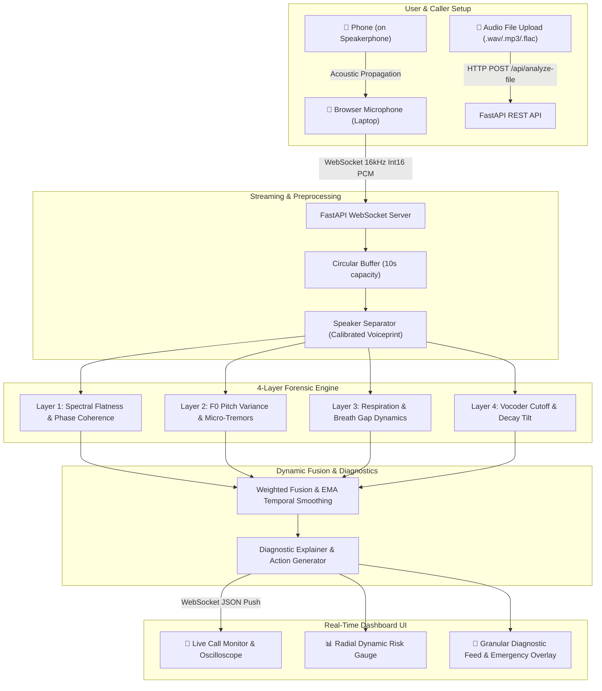

# 🛡️ VoxSentinalX — AI-Powered Real-Time Voice Cloning Detection & Prevention

> **Smart India Hackathon (SIH) Problem Statement ID:** 26104  
> **Title:** AI-Powered Real-Time Detection and Prevention of Voice Cloning Impersonation Attacks  
> **Version:** 1.0.0

---

## 🌟 Overview & Core Differentiator

**VoxSentinalX** is a next-generation real-time voice cloning and deepfake detection system engineered to protect individuals, contact centers, and financial institutions from synthetic speech social engineering attacks.

### 🎯 Key Innovations
1. **Beyond Binary (`FAKE` / `REAL`) Labels**: Provides **granular diagnostic messages** explaining the exact acoustic failure points (e.g. *Spectral Flatness 0.91*, *Missing Micro-Tremors*, *Respiration Pause Absence*, *Vocoder STFT Phase Discontinuities*).
2. **Approach 1 (Zero-Friction Live Audio Ingestion)**: Uses browser microphone audio capture on speakerphone with **dynamic voiceprint calibration** to isolate the incoming phone caller's voice from the user's voice.
3. **Multi-Layer Forensic Analysis**: 4-Layer decomposed forensic scoring (Spectral, Prosody/Pitch, Respiration Cadence, and Neural Vocoder Artifacts).
4. **Millisecond-Latency Sliding Window**: 2.0-second sliding windows with 1.0-second hops processed in $< 100\text{ ms}$ via full-duplex WebSockets.
5. **Instant Mid-Call Countermeasures**: Dynamic risk velocity tracking flags abrupt voice swaps and prompts users with actionable steps (e.g. *Out-of-band OTP Callback*, *Challenge Questions*, *Forensic Incident Log Export*).
6. **DPDP Act 2023 & IT Act Compliant**: Zero persistent audio recordings stored by default; in-memory processing with automatic RAM purging.

---

## 🏗️ System Architecture



---

## 🚀 Quick Start Guide

### 1. Prerequisites
- **Python 3.10+** (Tested on Python 3.11)
- **Node.js 18+** & **npm**

### 2. Backend Setup & Launch
```bash
# Navigate to backend directory
cd backend

# Install dependencies
python -m pip install -r requirements.txt

# Start backend server (runs at http://localhost:8000)
python run.py
```

* Backend API Docs (Swagger): [http://localhost:8000/docs](http://localhost:8000/docs)
* Health Endpoint: [http://localhost:8000/api/health](http://localhost:8000/api/health)
* WebSocket Endpoint: `ws://localhost:8000/ws/analyze`

### 3. Frontend Setup & Launch
```bash
# Navigate to frontend directory
cd frontend

# Install dependencies (if not already installed)
npm install

# Start Vite development server (runs at http://localhost:3000)
npm run dev
```

Open [http://localhost:3000](http://localhost:3000) in Google Chrome or Microsoft Edge.

---

## 🧪 Running Automated Tests

Run the comprehensive pytest suite covering buffers, detectors, WebSocket streaming, and REST APIs:

```bash
python -m pytest tests/ -v
```

**Test Suite Coverage (14/14 Passed):**
- `test_audio_buffer.py`: PCM Int16/Float32 conversions, sliding window hop boundaries, circular buffer capacity.
- `test_detectors.py`: Spectral flatness, phase coherence, F0 pitch tracking, micro-tremors, breathing cadence, vocoder artifacts.
- `test_fusion_scorer.py`: Weighted risk fusion, EMA temporal smoothing, voice swap velocity spike detection.
- `test_websocket_stream.py`: Full-duplex WebSocket stream simulation.
- `test_file_upload.py`: Audio file upload and forensic report generation.

---

## 📱 Live Demo Scenarios for SIH Judges

### Scenario 1: Live Call Voice Cloning Interception
1. Open the dashboard at `http://localhost:3000` on your laptop.
2. Click **"Voiceprint Calibration"** and speak: *"Hello, this is my voice calibration for VoxSentinalX"* (takes 3s).
3. Click **"Start Live Monitoring"**.
4. Place a regular phone call on speakerphone next to the laptop mic. Speak naturally $\to$ Risk Gauge stays 🟢 **LOW (< 30%)**.
5. Play an AI-cloned or TTS audio sample near the speakerphone $\to$ Risk Gauge instantly surges to 🔴 **CRITICAL (> 80%)**, emergency countermeasure banner appears with detailed forensic breakdown.

### Scenario 2: Audio File Forensic Audit
1. Switch to the **"File Analyzer"** tab.
2. Drag and drop any `.wav` or `.mp3` recording.
3. Click **"Run Forensic Analysis"**.
4. Review the timeline trajectory chart, peak risk rating, and forensic anomaly table. Export report as JSON.

---

## 🔒 Privacy & Compliance Architecture
- **In-Memory Processing**: Audio streams are analyzed directly in RAM and discarded after sliding windows are processed.
- **Zero Raw Recording Retention**: Complies with **DPDP Act 2023** and **IT Act 2000**.
- **Feature-Only Audit Telemetry**: Only anonymized numerical forensic indicators (e.g. flatness ratio, F0 variance) are recorded for security logs.
