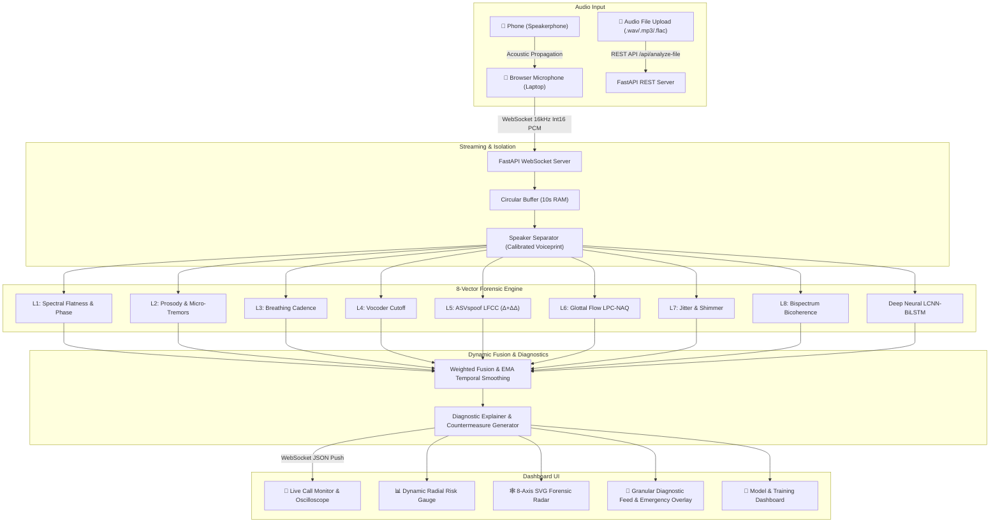

# 🛡️ VoxSentinalX — AI-Powered Real-Time Voice Cloning Detection & Prevention

> **Smart India Hackathon (SIH) Problem Statement ID:** 26104  
> **Title:** AI-Powered Real-Time Detection and Prevention of Voice Cloning Impersonation Attacks  
> **Version:** 2.0.0 (Comprehensive Multi-Technique Forensic & Deep Neural Training Suite)

---

## 🌟 Overview & Core Differentiators

**VoxSentinalX** is a military-grade, real-time voice cloning and deepfake detection system engineered to protect individuals, contact centers, and financial institutions from synthetic speech impersonation.

### 🎯 Key Innovations
1. **8-Vector Decomposed Forensic Suite**:
   - **Layer 1: Spectral & STFT Phase Coherence**: Unnatural spectral flatness and STFT inversion phase discontinuities.
   - **Layer 2: Prosodic Dynamics**: Fundamental frequency ($F_0$) pitch variance ($\sigma$) and 8–12 Hz involuntary vocal micro-tremors.
   - **Layer 3: Respiration Dynamics**: Unbroken continuous speech duration lacking natural human inhalation pauses.
   - **Layer 4: Vocoder Filters**: High-frequency brickwall filter cutoffs (4kHz / 8kHz) and unnatural spectral tilt slopes.
   - **Layer 5: ASVspoof Standard LFCC ($\Delta + \Delta\Delta$)**: Linear Frequency Cepstral Coefficients capturing high-frequency spectral quantization.
   - **Layer 6: Biomechanical Glottal Flow (LPC-NAQ)**: Vocal fold inverse filtering and Normalized Amplitude Quotient (NAQ) compliance.
   - **Layer 7: Laryngeal Perturbation (Jitter & Shimmer)**: Period-to-period micro-instability (Jitter local, RAP) and amplitude perturbation (Shimmer local, APQ3).
   - **Layer 8: Higher-Order Bispectral Phase Coupling (QPC)**: Non-linear bicoherence across vocal harmonic frequencies.
   - **Deep Neural Ensemble: Light-CNN (LCNN)**: PyTorch Convolutional network with Max-Feature-Map (MFM) activations, BiLSTM, and Self-Attention Pooling.
2. **Approach 1 (Zero-Friction Live Audio Ingestion)**: Browser microphone audio capture on speakerphone with **dynamic voiceprint calibration** to isolate the incoming phone caller's voice from the user's voice.
3. **Internet Dataset Harvester & PyTorch Training Suite**: Built-in support for ASVspoof 5 (2024), ASVspoof 2019, Fake-or-Real (FoR), IndicSynth (12 Indian languages), and CommonVoice + adversarial synthetic audio generator.
4. **Beyond Binary Labels**: Human-readable diagnostic cards with exact measured telemetry, thresholds, and actionable security countermeasures.

---

## 🏗️ System Architecture



---

## 🚀 Quick Start Guide (CMD / One-Click)

### ⚡ One-Click Launch (Recommended)
Double-click or run from CMD:
```cmd
p:\VoxSentinalX\run_all.bat
```

### 💻 Manual Command Prompt Execution

#### 1. Backend Server (FastAPI + WebSockets + PyTorch LCNN)
```cmd
cd /d p:\VoxSentinalX\backend
python run.py
```
* **API Server:** `http://localhost:8000`
* **Swagger Documentation:** `http://localhost:8000/docs`
* **WebSocket Ingestion:** `ws://localhost:8000/ws/analyze`

#### 2. Frontend Dashboard (React + Web Audio API + Radar)
```cmd
cd /d p:\VoxSentinalX\frontend
npm run dev
```
* **Web Dashboard:** Open **[`http://localhost:3000`](http://localhost:3000)** in Chrome or Edge.

---

## 🧪 Running Automated Tests

Run all 20 automated tests:
```cmd
cd /d p:\VoxSentinalX
python -m pytest tests/ -v
```

**Test Suite Coverage (20/20 Passed - 100%):**
- `test_audio_buffer.py`: PCM Int16/Float32 conversions, sliding window hop boundaries, circular buffer capacity.
- `test_detectors.py`: Spectral flatness, phase coherence, F0 pitch tracking, micro-tremors, breathing cadence, vocoder artifacts.
- `test_new_detectors.py`: LFCC ($\Delta+\Delta\Delta$), Glottal flow LPC-NAQ, Jitter & Shimmer, Higher-order Bispectrum bicoherence.
- `test_neural_inference.py`: PyTorch LCNN-BiLSTM-Attention forward pass & spoof probability calibration.
- `test_fusion_scorer.py`: 8-vector weighted risk fusion, EMA temporal smoothing, voice swap velocity spike detection.
- `test_websocket_stream.py`: Full-duplex WebSocket stream simulation.
- `test_file_upload.py`: Audio file upload and forensic report generation.

---

## 🧠 Training & Model Retraining Suite

Train the deep neural detector on local or internet datasets:
```cmd
# 1. Generate adversarial training samples
python training/dataset_generator.py

# 2. Train the PyTorch Light-CNN model with Focal Loss
python training/train.py --epochs 10 --batch_size 16

# 3. Evaluate benchmark metrics (Accuracy, EER, Precision, Recall)
python training/evaluate.py
```
*Or use the **"Model & Training"** tab directly in the web dashboard UI.*
