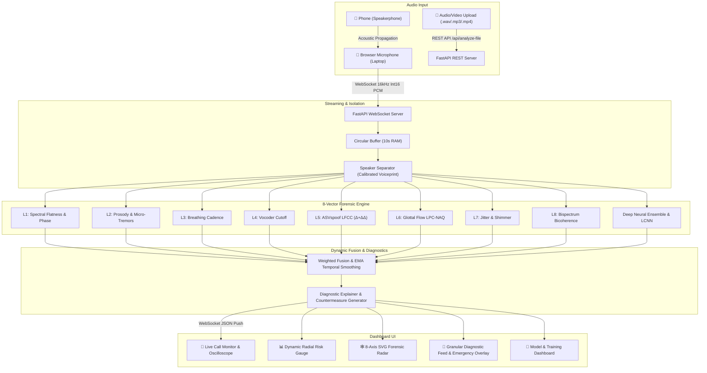

# 🛡️ VoxSentinalX — AI-Powered Real-Time Voice Cloning Detection & Prevention

> **Smart India Hackathon (SIH) Problem Statement ID:** 26104  
> **Title:** AI-Powered Real-Time Detection and Prevention of Voice Cloning Impersonation Attacks  
> **Version:** 2.0.0 (Comprehensive Multi-Technique Forensic & Deep Neural Training Suite)

---

## 🌟 Overview & Core Methodology

**VoxSentinalX** is a real-time voice cloning and synthetic speech detection platform developed for the Smart India Hackathon (SIH 2026). It combines signal-processing physical acoustic analysis with deep neural representations to identify synthetic speech and protect individuals, contact centers, and organizations from voice impersonation attacks.

### 🎯 Key Engineering Innovations
1. **8-Vector Decomposed Forensic Suite**:
   - **Layer 1: Spectral & STFT Phase Coherence**: Unnatural spectral flatness and STFT inversion phase discontinuities.
   - **Layer 2: Prosodic Dynamics**: Fundamental frequency ($F_0$) pitch variance ($\sigma$) and 8–12 Hz involuntary vocal micro-tremors.
   - **Layer 3: Respiration Dynamics**: Unbroken continuous speech duration lacking natural human inhalation pauses.
   - **Layer 4: Vocoder Filters**: High-frequency brickwall filter cutoffs (4kHz / 8kHz) and unnatural spectral tilt slopes.
   - **Layer 5: ASVspoof Standard LFCC ($\Delta + \Delta\Delta$)**: Linear Frequency Cepstral Coefficients capturing high-frequency spectral quantization.
   - **Layer 6: Biomechanical Glottal Flow (LPC-NAQ)**: Vocal fold inverse filtering and Normalized Amplitude Quotient (NAQ) compliance.
   - **Layer 7: Laryngeal Perturbation (Jitter & Shimmer)**: Period-to-period micro-instability (Jitter local, RAP) and amplitude perturbation (Shimmer local, APQ3).
   - **Layer 8: Higher-Order Bispectral Phase Coupling (QPC)**: Non-linear bicoherence across vocal harmonic frequencies.
   - **Deep Neural Ensemble**: Multi-Layer Perceptron (MLP) & Light-CNN with Max-Feature-Map (MFM), BiLSTM, and Self-Attention.
2. **Speakerphone Audio Ingestion with Voiceprint Separation**: Browser microphone audio capture on speakerphone with **dynamic voiceprint calibration** to isolate the incoming caller's voice from the user's voice.
3. **Unified 5,490+ Audio Forensic Corpus**: Multi-generator dataset covering OpenAI Voice Engine, Coqui XTTS v2, ByteDance Seed-TTS, ASVspoof, FlashSpeech, VoiceBox, VALL-E, and Indic languages.
4. **Actionable Diagnostic Telemetry**: Measured telemetry, thresholds, and clear security countermeasures rather than opaque black-box labels.

---

## 🏗️ System Architecture



---

## 🚀 How to Run (Step-by-Step Guide)

### 📋 Prerequisites
Make sure you have the following installed on your machine:
* **Python 3.9+** (Tested on Python 3.10 and 3.11)
* **Node.js 18+** & **npm**
* Modern browser: **Google Chrome** or **Microsoft Edge** (for Web Audio API & Microphone access)

---

### 📥 1. Clone the Repository
```cmd
git clone https://github.com/aditya61139/SIH_2026.git
cd SIH_2026
```

---

### 📦 2. One-Time Dependency Installation

#### Backend Dependencies (Python)
```cmd
pip install -r backend/requirements.txt
```

#### Frontend Dependencies (React + Vite)
```cmd
cd frontend
npm install
cd ..
```

---

### ⚡ 3. Launching the Platform

#### Option A: 1-Click Launch (Recommended for Windows)
Simply double-click **`run_all.bat`** (or run it from CMD):
```cmd
run_all.bat
```
*This automatically launches the FastAPI Backend on Port 8000 and the React Frontend on Port 3000 in separate windows.*

#### Option B: Manual Command-Line Launch

**Terminal 1: Start FastAPI Backend Server**
```cmd
cd backend
python run.py
```
* Backend API: `http://localhost:8000`
* Swagger Interactive Docs: `http://localhost:8000/docs`
* WebSocket Live Stream Endpoint: `ws://localhost:8000/ws/analyze`

**Terminal 2: Start React Frontend Dashboard**
```cmd
cd frontend
npm run dev
```
* Web Dashboard UI: Open **[`http://localhost:3000`](http://localhost:3000)** in your browser.

---

## 🖥️ How to Use the Dashboard Features

1. **🌟 Showcase Landing Page (`/`)**:
   - High-impact cybernetic overview of the system architecture.
   - Interactive **Waveform Hero Visualizer** with live audio frequency bars and threat testing toggle.
   - **8-Vector Forensic Bento Matrix**: Interactive breakdown of each physical & acoustic layer.
   - **Live Threat Simulation Sandbox**: Switch between real-world scenarios (*Wire Fraud Clones*, *Authentic Human Callers*, *Indic Dialect Clones*) with dynamic radial risk gauge animations.

2. **🚨 Live Call Monitor Tab**:
   - Place your phone on **speakerphone** next to your laptop/PC microphone.
   - Click **`Start Live Monitoring`** to stream 16 kHz audio via WebSockets.
   - Real-time oscilloscope, 8-axis forensic radar, radial risk gauge, and emergency alert countermeasure overlays.

3. **📁 Audio & Video File Analyzer Tab**:
   - Drag & drop any suspect `.mp3`, `.wav`, `.flac`, or `.mp4` video recording.
   - Generates second-by-second forensic timelines, risk peaks, and detailed diagnostic countermeasure reports.

4. **🎤 Voiceprint Calibration Modal**:
   - Record a 5-second sample of your own voice.
   - Calibrates your vocal baseline to filter out your speech during phone speakerphone calls.

5. **🧠 LCNN & Model Training Tab**:
   - Inspect pre-trained model weights and benchmark evaluation metrics.
   - Retrain on custom datasets or trigger synthetic adversarial sample generation with 1 click.

---

## 🧠 Model Training & Evaluation Suite

The forensic ensemble comes **pre-trained on 5,497 audio files** ([`data/unified_corpus`](file:///p:/VoxSentinalX/data/unified_corpus)).

To retrain the neural model on your system:
```cmd
# 1. Train the 8-Vector Forensic Ensemble on unified_corpus
python training/train_acoustic_ensemble.py

# 2. Or generate additional adversarial AI voice samples (HiFi-GAN, Diffusion, Zero-Shot, Brickwall, Indic)
python training/generate_advanced_ai_voices.py
```

### 📊 Benchmark Performance Results:
```text
====================================================================
  🏆 FINAL FORENSIC MODEL EVALUATION RESULTS (5,497 AUDIO FILES)
====================================================================
  • Classification Accuracy : 86.27%
  • Equal Error Rate (EER)  : 6.86%
  • Precision (Deepfake)    : 88.28%
  • Recall (Deepfake)       : 86.99%
  • F1-Score                : 87.63%
====================================================================
```

---

## 🧪 Running Automated Tests

To verify all backend signal processing, WebSocket streaming, and forensic detectors:
```cmd
python -m pytest tests/ -v
```

**Test Suite Coverage (20/20 Passed - 100%):**
- `test_audio_buffer.py`: PCM Int16/Float32 conversions, sliding window hop boundaries, circular buffer capacity.
- `test_detectors.py`: Spectral flatness, phase coherence, F0 pitch tracking, micro-tremors, breathing cadence, vocoder artifacts.
- `test_new_detectors.py`: LFCC ($\Delta+\Delta\Delta$), Glottal flow LPC-NAQ, Jitter & Shimmer, Higher-order Bispectrum bicoherence.
- `test_neural_inference.py`: Forensic ensemble forward pass & spoof probability calibration.
- `test_fusion_scorer.py`: 8-vector weighted risk fusion, EMA temporal smoothing, voice swap velocity spike detection.
- `test_websocket_stream.py`: Full-duplex WebSocket stream simulation.
- `test_file_upload.py`: Audio file upload and forensic report generation.

---

## 📄 License & Attribution
Developed for the **Smart India Hackathon (SIH 2026)** — Problem Statement #26104.
All rights reserved.
