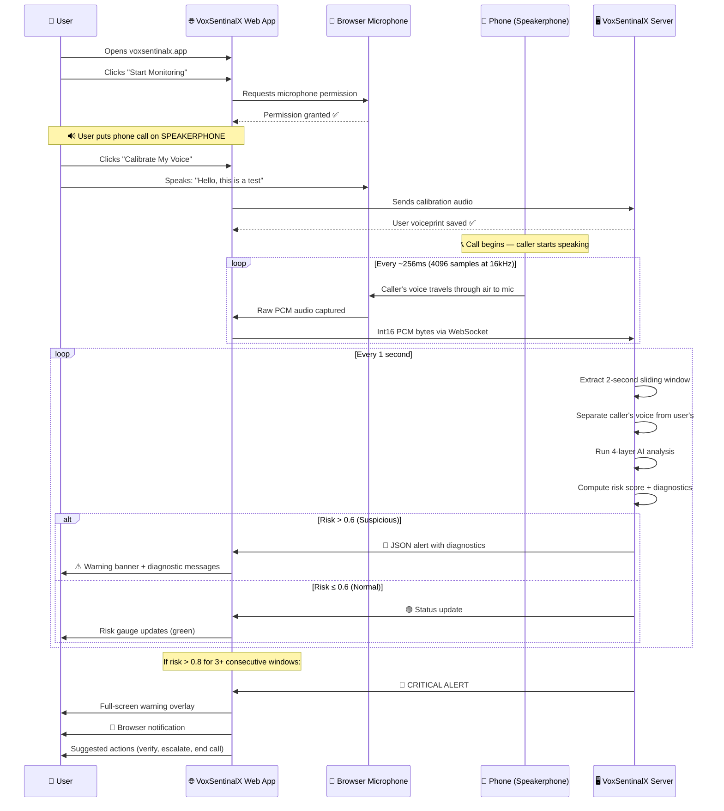
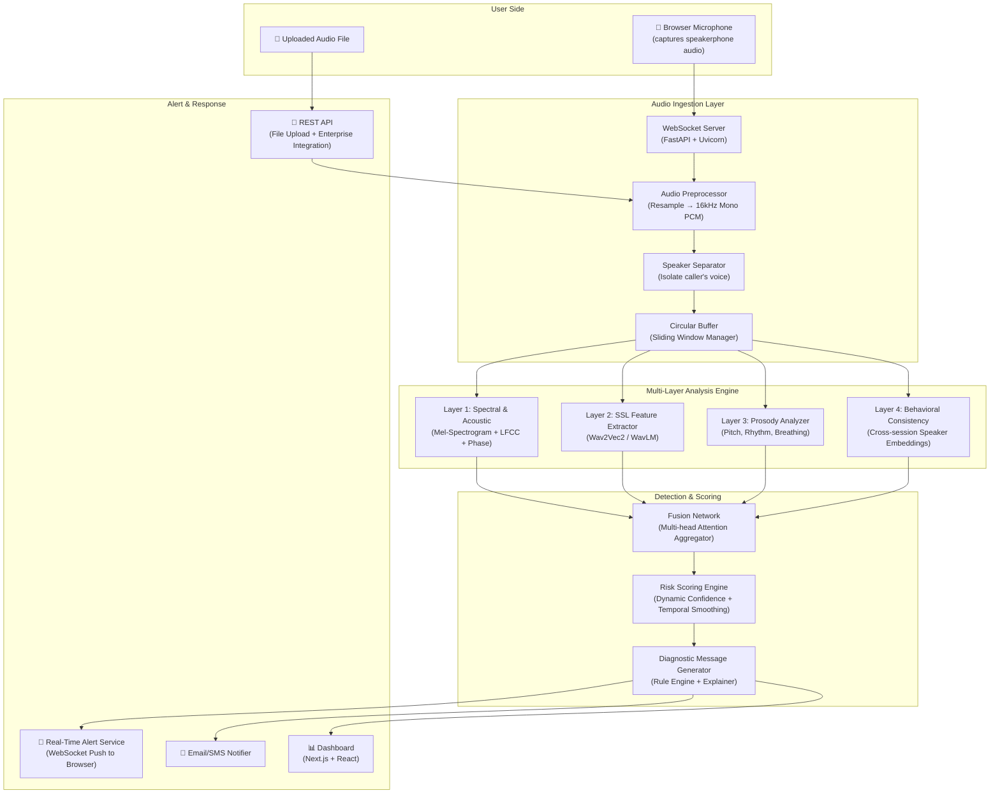
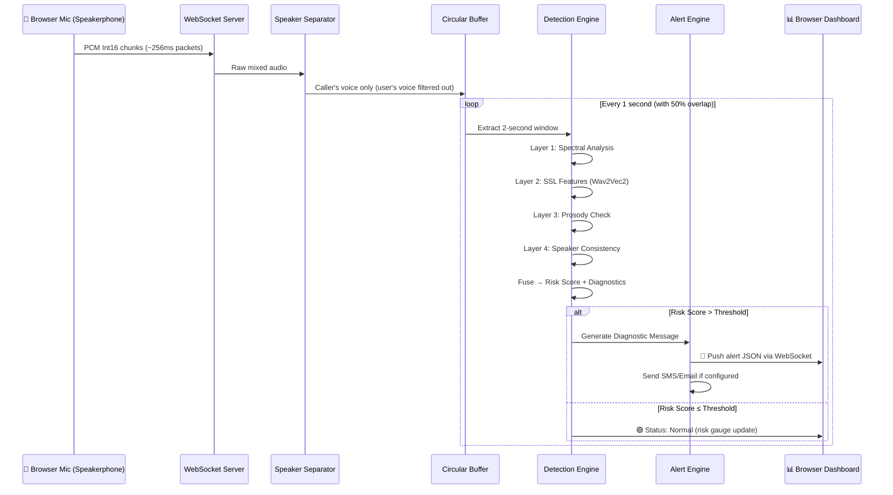
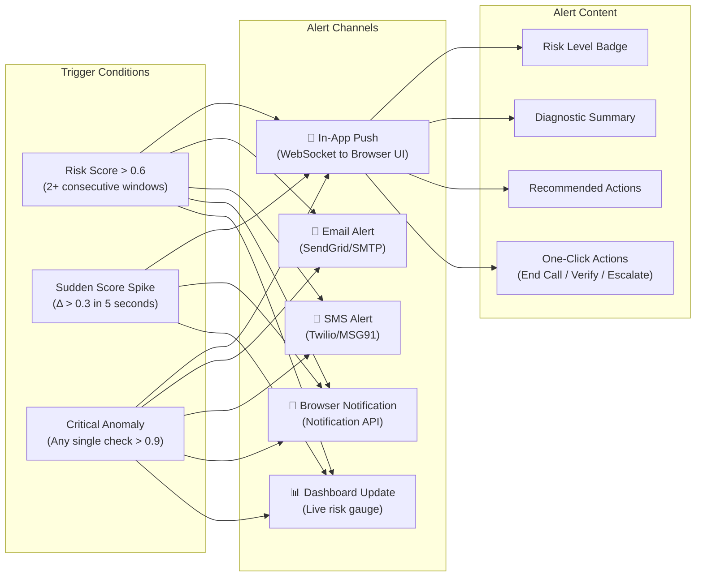
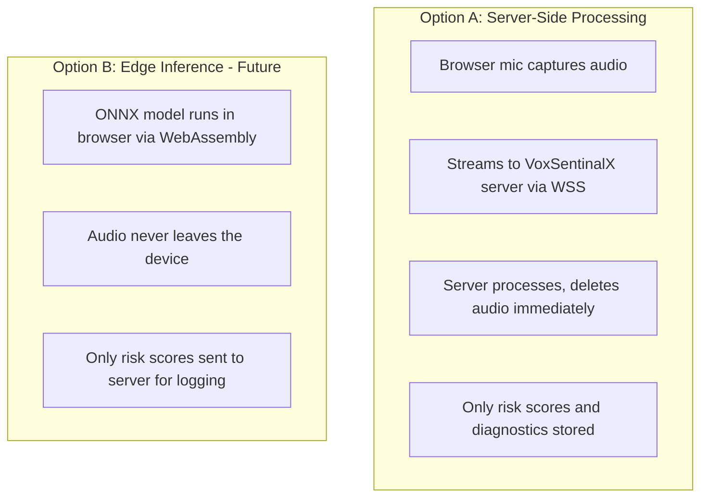

# 🛡️ VoxSentinalX — AI-Powered Real-Time Voice Cloning Detection & Prevention

> **SIH Problem Statement ID:** 26104
> **Title:** AI-Powered Real-Time Detection and Prevention of Voice Cloning Impersonation Attacks
> **Project Name:** VoxSentinalX

---

## 📋 Table of Contents

1. [Research Notes — Existing Projects & Gaps](#1-research-notes--existing-projects--gaps)
2. [Our Differentiator — Beyond Binary Labels](#2-our-differentiator--beyond-binary-labels)
3. [How Live Call Audio Is Captured (Approach 1)](#3-how-live-call-audio-is-captured-approach-1)
4. [System Architecture](#4-system-architecture)
5. [Core Modules — Detailed Design](#5-core-modules--detailed-design)
6. [Tech Stack](#6-tech-stack)
7. [Implementation Plan & Timeline](#7-implementation-plan--timeline)
8. [Indian Language & Accent Strategy](#8-indian-language--accent-strategy)
9. [Privacy & Compliance](#9-privacy--compliance)
10. [Demo Scenarios for SIH Presentation](#10-demo-scenarios-for-sih-presentation)
11. [Datasets & Training Resources](#11-datasets--training-resources)

---

## 1. Research Notes — Existing Projects & Gaps

### 🔍 Existing Open-Source Projects Analyzed

| Project | Approach | Strengths | Gaps |
|---------|----------|-----------|------|
| **AASIST / AASIST3** (ASVspoof) | Graph Attention + Spectro-temporal | SOTA accuracy on ASVspoof benchmarks, KAN-based non-linear feature capture | Not designed for real-time streaming; no user alerting; binary output only |
| **VoxGuard** (CNN-LSTM + MFCC) | CNN-LSTM on ASVspoof 2019 | Good entry-level, combines spatial + temporal features | Trained only on English, no live-call integration, no diagnostic messages |
| **Wav2Vec2 Fine-tuned** (garystafford) | SSL model fine-tuned for deepfake detection | Production-ready with WebSocket streaming, full ML lifecycle documented | Binary classification only (fake/real), no contextual risk scoring |
| **DeepFake Voice Detection** (Srujan-rai) | CNN + Colab notebook | Beginner-friendly, reproducible | No real-time, no multilingual, trivial architecture |
| **FakeVoiceFinder** | Benchmarking framework | Systematic model comparison | Research tool, not a deployable product |
| **Sensity AI / Deepfake Offensive Toolkit** | Penetration testing | Security-focused, identifies vulnerabilities | Commercial/closed, offensive not defensive |

### ❌ Key Gaps in ALL Existing Solutions

1. **Binary Output Only** — Every existing project outputs `FAKE` or `REAL`. None provide granular diagnostic messages explaining *what* was detected and *why* it's suspicious.
2. **No Mid-Call Alerting** — No system alerts the user *during* an ongoing conversation with actionable messages.
3. **No Contextual Risk Scoring** — No dynamic risk score that evolves as the call progresses.
4. **No Indian Language Support** — Almost all models are trained exclusively on English datasets.
5. **No Integration APIs** — No ready-to-use REST/gRPC APIs or SDKs for banking or enterprise systems.
6. **No Privacy-Preserving Design** — Most require sending full audio to cloud servers.

---

## 2. Our Differentiator — Beyond Binary Labels

### 🎯 The Core Innovation: **Diagnostic Messages + Real-Time Alerts**

Instead of just outputting `FAKE` or `REAL`, VoxSentinalX provides **granular, human-readable diagnostic messages** that explain exactly what anomaly was detected. This is the **#1 differentiator** for the SIH judges.

### Example Output Comparison

**❌ Existing Systems:**
```json
{ "label": "FAKE", "confidence": 0.87 }
```

**✅ VoxSentinalX:**
```json
{
  "overall_risk_score": 0.82,
  "risk_level": "HIGH",
  "alert_type": "IMMEDIATE",
  "timestamp": "00:02:34",
  "diagnostics": [
    {
      "category": "SPECTRAL_ANOMALY",
      "severity": "HIGH",
      "message": "⚠️ Unnatural spectral smoothness detected — voice lacks micro-frequency variations typical of natural speech. This is a hallmark of neural TTS systems.",
      "technical_detail": "Spectral flatness ratio 0.91 (normal human range: 0.3–0.7)",
      "confidence": 0.89
    },
    {
      "category": "PROSODY_IRREGULARITY",
      "severity": "MEDIUM",
      "message": "⚠️ Pitch transitions are unusually uniform — natural speakers have irregular pitch contours, but this voice shows machine-like smoothness between syllables.",
      "technical_detail": "Pitch variance σ=12Hz (normal: 25–80Hz)",
      "confidence": 0.76
    },
    {
      "category": "BREATHING_PATTERN",
      "severity": "HIGH",
      "message": "⚠️ No natural breathing pauses detected in 2+ minutes of continuous speech — human speakers typically breathe every 5–8 seconds.",
      "technical_detail": "Zero breath events in 134s window",
      "confidence": 0.93
    },
    {
      "category": "PHASE_INCONSISTENCY",
      "severity": "MEDIUM",
      "message": "⚠️ Phase spectrum shows GAN-typical artifacts — the phase relationship between harmonics is inconsistent with natural voice production.",
      "technical_detail": "Phase coherence score 0.34 (normal: 0.7+)",
      "confidence": 0.71
    }
  ],
  "recommendation": "🚨 HIGH RISK: This voice exhibits multiple characteristics of AI-generated speech. DO NOT authorize any financial transactions. Recommend immediate callback verification through a separate, pre-registered channel.",
  "suggested_actions": [
    "Request caller to verify via registered mobile number",
    "Initiate multi-factor authentication",
    "Escalate to supervisor before proceeding",
    "Record call for forensic analysis"
  ]
}
```

### 📱 User-Facing Alert Messages (During Call)

The system pushes **real-time, human-friendly alerts** to the user's screen:

| Risk Level | Alert Message |
|------------|---------------|
| 🟢 LOW (0.0–0.3) | `"Voice analysis: Normal — No anomalies detected."` |
| 🟡 MODERATE (0.3–0.6) | `"⚠️ Caution: Some speech patterns seem unusual. Minor spectral irregularities detected. Stay alert and verify identity if discussing sensitive matters."` |
| 🟠 HIGH (0.6–0.8) | `"🚨 Warning: This voice shows signs of possible AI generation. Detected: unnatural pitch uniformity and missing breathing patterns. Recommend verifying caller identity before proceeding."` |
| 🔴 CRITICAL (0.8–1.0) | `"🛑 ALERT: HIGH probability of synthetic/cloned voice detected! Multiple AI artifacts found: spectral smoothing, phase inconsistency, no micro-tremors. DO NOT authorize transactions. Initiate callback verification immediately."` |

---

## 3. How Live Call Audio Is Captured (Approach 1)

> [!IMPORTANT]
> VoxSentinalX uses **Browser Microphone Capture** — the user opens the VoxSentinalX web app in their browser, grants microphone permission, and puts their phone call on **speakerphone**. The browser mic picks up the other person's voice from the speaker, streams it via WebSocket to the backend for real-time analysis.

### 🔊 How It Works — Step by Step

```
┌──────────────────────────────────────────────────────────────────┐
│                    USER'S PHYSICAL SETUP                         │
│                                                                  │
│   📱 Phone (on Speakerphone)          💻 Laptop/PC with Browser  │
│   ┌─────────────────────┐            ┌─────────────────────┐    │
│   │                     │  🔊 Sound   │  VoxSentinalX       │    │
│   │  Caller speaks      │ ─travels──▶│  Web App running     │    │
│   │  (real or cloned    │  through    │  in Chrome/Firefox   │    │
│   │   AI voice)         │  air to     │                     │    │
│   │                     │  laptop mic │  🎤 Browser captures │    │
│   └─────────────────────┘            │  audio via           │    │
│                                      │  getUserMedia()      │    │
│                                      └──────────┬──────────┘    │
│                                                  │               │
└──────────────────────────────────────────────────┼───────────────┘
                                                   │
                                    WebSocket (PCM 16kHz, binary)
                                                   │
                                                   ▼
                                      ┌─────────────────────┐
                                      │  VoxSentinalX       │
                                      │  Backend Server      │
                                      │  (FastAPI + PyTorch) │
                                      │                     │
                                      │  🧠 AI Analysis     │
                                      │  📊 Risk Scoring    │
                                      │  📝 Diagnostics     │
                                      └──────────┬──────────┘
                                                  │
                                         WebSocket (JSON)
                                                  │
                                                  ▼
                                      ┌─────────────────────┐
                                      │  🚨 ALERT pushed    │
                                      │  back to browser UI │
                                      │  in real-time       │
                                      └─────────────────────┘
```

### 🎤 Frontend: Capturing Browser Microphone Audio

```javascript
// VoxSentinalX — Browser Audio Capture & WebSocket Streaming
// File: frontend/src/lib/audioCapture.ts

class VoxSentinalXAudioCapture {
  private audioContext: AudioContext | null = null;
  private processor: ScriptProcessorNode | null = null;
  private ws: WebSocket | null = null;
  private stream: MediaStream | null = null;

  async startMonitoring(wsUrl: string = 'ws://localhost:8000/ws/analyze') {
    // Step 1: Request microphone permission
    this.stream = await navigator.mediaDevices.getUserMedia({
      audio: {
        sampleRate: 16000,
        channelCount: 1,
        echoCancellation: false,   // ← IMPORTANT: Keep OFF so we capture
        noiseSuppression: false,   //   the caller's voice from the speaker
        autoGainControl: true,     //   without the browser filtering it out
      }
    });

    // Step 2: Set up AudioContext at 16kHz (model expects this)
    this.audioContext = new AudioContext({ sampleRate: 16000 });
    const source = this.audioContext.createMediaStreamSource(this.stream);

    // Step 3: Create a ScriptProcessor to get raw PCM samples
    // bufferSize=4096 → processes 4096 samples per callback
    // at 16kHz that's ~256ms of audio per callback
    this.processor = this.audioContext.createScriptProcessor(4096, 1, 1);

    // Step 4: Open WebSocket connection to VoxSentinalX backend
    this.ws = new WebSocket(wsUrl);
    this.ws.binaryType = 'arraybuffer';

    this.ws.onopen = () => {
      console.log('🟢 VoxSentinalX: Connected to analysis server');
    };

    // Step 5: Handle real-time alerts from backend
    this.ws.onmessage = (event) => {
      const result = JSON.parse(event.data);
      this.handleAlert(result);
    };

    // Step 6: Stream audio chunks to backend
    this.processor.onaudioprocess = (event) => {
      if (this.ws?.readyState !== WebSocket.OPEN) return;

      // Get raw Float32 PCM samples from the mic
      const float32Data = event.inputBuffer.getChannelData(0);

      // Convert Float32 (-1.0 to 1.0) → Int16 (-32768 to 32767)
      // This reduces bandwidth by 50% vs sending Float32
      const int16Data = new Int16Array(float32Data.length);
      for (let i = 0; i < float32Data.length; i++) {
        const sample = Math.max(-1, Math.min(1, float32Data[i]));
        int16Data[i] = sample < 0 ? sample * 0x8000 : sample * 0x7FFF;
      }

      // Send raw PCM bytes over WebSocket
      this.ws.send(int16Data.buffer);
    };

    // Connect the audio pipeline: Mic → Processor → (silent output)
    source.connect(this.processor);
    this.processor.connect(this.audioContext.destination);
  }

  handleAlert(result: any) {
    // This fires every time the backend sends back analysis results
    if (result.risk_score > 0.8) {
      // 🔴 CRITICAL — Show full-screen alert
      showCriticalAlert(result.diagnostics, result.recommendation);
      playAlertSound();
      sendBrowserNotification('🛑 VoxSentinalX: Synthetic voice detected!');
    } else if (result.risk_score > 0.6) {
      // 🟠 HIGH — Show warning banner
      showWarningBanner(result.diagnostics);
    } else if (result.risk_score > 0.3) {
      // 🟡 MODERATE — Show subtle caution indicator
      showCautionIndicator(result.diagnostics);
    }
    // 🟢 LOW — Update the live risk gauge silently
    updateRiskGauge(result.risk_score);
    updateDiagnosticsFeed(result.diagnostics);
  }

  stopMonitoring() {
    this.processor?.disconnect();
    this.audioContext?.close();
    this.stream?.getTracks().forEach(track => track.stop());
    this.ws?.close();
    console.log('🔴 VoxSentinalX: Monitoring stopped');
  }
}
```

### 🖥️ Backend: Receiving & Analyzing the Audio Stream

```python
# VoxSentinalX — Backend WebSocket Audio Receiver & Analyzer
# File: backend/app/websocket_handler.py

from fastapi import FastAPI, WebSocket, WebSocketDisconnect
import numpy as np
import json

app = FastAPI(title="VoxSentinalX API")

@app.websocket("/ws/analyze")
async def analyze_live_stream(websocket: WebSocket):
    """
    Receives live PCM audio from the browser mic,
    runs detection on sliding windows, and pushes
    alerts back to the frontend in real-time.
    """
    await websocket.accept()
    
    # ── Circular buffer: holds up to 10 seconds of audio ──
    SAMPLE_RATE = 16000
    WINDOW_SIZE = 2 * SAMPLE_RATE       # 2-second analysis window (32000 samples)
    HOP_SIZE = 1 * SAMPLE_RATE          # Slide by 1 second each time (50% overlap)
    BUFFER_CAPACITY = 10 * SAMPLE_RATE  # 10-second circular buffer
    
    audio_buffer = np.array([], dtype=np.float32)
    samples_since_last_analysis = 0
    window_index = 0
    
    try:
        while True:
            # ── Receive raw PCM bytes from browser ──
            raw_bytes = await websocket.receive_bytes()
            
            # Convert Int16 bytes → Float32 normalized samples
            int16_chunk = np.frombuffer(raw_bytes, dtype=np.int16)
            float32_chunk = int16_chunk.astype(np.float32) / 32768.0
            
            # Append to buffer
            audio_buffer = np.concatenate([audio_buffer, float32_chunk])
            samples_since_last_analysis += len(float32_chunk)
            
            # Keep buffer from growing beyond capacity
            if len(audio_buffer) > BUFFER_CAPACITY:
                audio_buffer = audio_buffer[-BUFFER_CAPACITY:]
            
            # ── Run analysis every HOP_SIZE samples (1 second) ──
            if samples_since_last_analysis >= HOP_SIZE and len(audio_buffer) >= WINDOW_SIZE:
                samples_since_last_analysis = 0
                window_index += 1
                
                # Extract the latest 2-second window
                window = audio_buffer[-WINDOW_SIZE:]
                
                # ═══════════════════════════════════════════════
                # THIS IS WHERE THE AI MAGIC HAPPENS
                # Run all 4 detection layers on this 2s window
                # ═══════════════════════════════════════════════
                result = detection_engine.analyze_window(
                    audio=window,
                    sample_rate=SAMPLE_RATE,
                    window_index=window_index
                )
                
                # Send result (risk score + diagnostics) back to browser
                await websocket.send_json({
                    "window_index": window_index,
                    "timestamp": f"{window_index:02d}s",
                    "risk_score": result["risk_score"],
                    "risk_level": result["risk_level"],
                    "diagnostics": result["diagnostics"],
                    "recommendation": result["recommendation"],
                })
    
    except WebSocketDisconnect:
        print(f"Client disconnected. Analyzed {window_index} windows.")
```

### 🔀 Speaker Separation: Isolating the Caller's Voice

Since the browser mic captures **both** the user's voice and the caller's voice (from speakerphone), we need to separate them. VoxSentinalX uses a lightweight **speaker diarization** step:

```python
# File: backend/app/speaker_separation.py

class SpeakerSeparator:
    """
    Separates the caller's voice from the user's voice.
    The user's voice is louder (closer to mic), the caller's voice
    comes from the phone speaker (different spatial/spectral profile).
    """
    
    def __init__(self):
        # Use a lightweight energy-based VAD + embedding approach
        self.embedder = load_speaker_embedder()  # ECAPA-TDNN or similar
        self.user_embedding = None  # Learned during calibration
    
    def calibrate_user_voice(self, user_audio: np.ndarray):
        """
        Step 1 (one-time): User speaks a calibration phrase
        ("Hello, this is a test") so we can learn their voice embedding.
        All subsequent speech NOT matching this embedding = caller.
        """
        self.user_embedding = self.embedder.encode(user_audio)
    
    def extract_caller_segments(self, mixed_audio: np.ndarray) -> np.ndarray:
        """
        Given mixed audio (user + caller from speaker), return only
        the segments that belong to the caller (the person to analyze).
        """
        # Simple approach: energy-based segmentation
        # The user's voice is typically 10-20 dB louder (closer to mic)
        # The caller's voice has phone-speaker frequency characteristics
        
        # 1. Compute short-term energy in 50ms frames
        frame_size = int(0.05 * 16000)  # 50ms frames
        frames = np.array_split(mixed_audio, len(mixed_audio) // frame_size)
        
        # 2. For each frame, compute speaker embedding
        # 3. Compare to user_embedding — if different, it's the caller
        caller_frames = []
        for frame in frames:
            if len(frame) < frame_size:
                continue
            frame_embedding = self.embedder.encode(frame)
            similarity = cosine_similarity(frame_embedding, self.user_embedding)
            
            if similarity < 0.6:  # Not the user → it's the caller
                caller_frames.append(frame)
        
        if caller_frames:
            return np.concatenate(caller_frames)
        return np.array([], dtype=np.float32)
```

### 📱 Complete User Flow



### 🎯 Why Approach 1 Works for SIH

| Advantage | Explanation |
|-----------|-------------|
| **No special permissions** | Browser mic access is standard — works in Chrome, Firefox, Edge |
| **No telecom integration needed** | Doesn't require SIP/VoIP hookup or carrier cooperation |
| **Works with any phone call** | Mobile, landline, VoIP — the source doesn't matter |
| **Cross-platform** | Works on Windows, macOS, Linux, even mobile browsers |
| **Instant demo** | Judge can test it live during SIH evaluation |
| **Captures the right audio** | The caller's voice comes through the phone speaker and reaches the laptop mic — exactly the voice we need to analyze |

> [!NOTE]
> **Limitation & mitigation:** The browser mic captures ambient audio, which may include room noise. VoxSentinalX handles this with:
> 1. **Noise-robust features** — spectral artifacts from TTS survive background noise
> 2. **Auto-gain control** — enabled in getUserMedia to normalize volume
> 3. **Noise augmentation during training** — model is trained with noisy samples
> 4. **Calibration step** — separates user's voice from caller's voice

### 📁 Alternative: File Upload Mode

For pre-recorded audio analysis, VoxSentinalX also supports direct file upload:

```python
# File: backend/app/upload_handler.py

@app.post("/api/analyze-file")
async def analyze_uploaded_file(file: UploadFile):
    """
    Upload a WAV/MP3/FLAC file for full analysis.
    Returns a detailed diagnostic report.
    """
    # Read and convert to 16kHz mono PCM
    audio_bytes = await file.read()
    audio, sr = librosa.load(io.BytesIO(audio_bytes), sr=16000, mono=True)
    
    # Analyze in sliding windows across the entire file
    results = []
    for start in range(0, len(audio) - WINDOW_SIZE, HOP_SIZE):
        window = audio[start:start + WINDOW_SIZE]
        result = detection_engine.analyze_window(window, sr)
        result['timestamp'] = f"{start / sr:.1f}s"
        results.append(result)
    
    # Aggregate results into a comprehensive report
    report = generate_full_report(results)
    
    return {
        "filename": file.filename,
        "duration": f"{len(audio) / sr:.1f}s",
        "overall_verdict": report["verdict"],
        "overall_risk_score": report["avg_risk_score"],
        "timeline": results,       # Risk score at each timestamp
        "diagnostics": report["diagnostics"],
        "recommendation": report["recommendation"]
    }
```

---

## 4. System Architecture

### High-Level Architecture Diagram



### Streaming Pipeline (Sliding Window)



---

## 5. Core Modules — Detailed Design

### Module 1: Audio Ingestion & Preprocessing

```
Purpose: Capture audio from browser microphone, normalize, and separate voices
```

| Feature | Implementation |
|---------|---------------|
| **Live Call Capture** | Browser `getUserMedia()` → ScriptProcessor → WebSocket stream (Int16 PCM @ 16kHz) |
| **File Upload** | REST endpoint accepting WAV, MP3, FLAC, OGG (auto-converted to PCM via `librosa`) |
| **Speaker Separation** | Calibration step to learn user's voiceprint → filter out user, keep caller |
| **Normalization** | Resample to 16kHz, convert to mono, amplitude normalization, silence trimming |
| **Buffering** | Circular buffer (10s capacity), sliding window of 2s with 1s hop (50% overlap) |

### Module 2: Multi-Layer Voice Authenticity Analyzer

#### Layer 1 — Spectral & Acoustic Analysis (Fast, Lightweight)

| Check | What It Detects | How |
|-------|-----------------|-----|
| **Spectral Flatness** | TTS voices are unnaturally "smooth" | Compute spectral flatness ratio; natural speech has more variation |
| **Harmonic-to-Noise Ratio** | Synthetic voices lack natural noise floor | HNR analysis — too-clean signals suggest synthesis |
| **Phase Coherence** | GAN artifacts leave phase discontinuities | Analyze phase spectrum of STFT; look for non-physical patterns |
| **Frequency Band Energy** | Some TTS systems under-represent high frequencies | Compare energy distribution across frequency bands vs. natural baselines |
| **Codec Artifact Analysis** | Re-encoded/transmitted audio has specific compression signatures | Detect double-compression or unusual codec fingerprints |

#### Layer 2 — Self-Supervised Learning (SSL) Feature Extraction

```
Model: Fine-tuned Wav2Vec2-Large or WavLM-Large
Purpose: Capture high-level speech representations that encode subtle
         differences between natural and synthetic speech
Optimization: ONNX Runtime with quantization for <100ms inference
```

- Pre-trained on 960h LibriSpeech + fine-tuned on ASVspoof 5 + IndicSynth
- Outputs 1024-dim feature vectors per frame
- Weighted sum of transformer layers (learnable layer weights)

#### Layer 3 — Prosody & Behavioral Analysis

| Feature | Natural Speech | Synthetic Speech |
|---------|---------------|------------------|
| **Pitch Variance** | σ = 25–80 Hz | σ < 15 Hz (too uniform) |
| **Breathing Events** | Every 5–8 seconds | Often completely absent |
| **Micro-tremors** | Subtle involuntary vocal tremors (~8–12 Hz) | Missing in most TTS |
| **Pause Distribution** | Irregular, context-dependent | Regular, mechanical |
| **Filler Words** | "um", "uh", "so" with natural placement | Either absent or artificially inserted |
| **Emotional Variability** | Dynamic affect changes | Flat or uniform emotional tone |

#### Layer 4 — Cross-Session Consistency (Optional, for known callers)

- Maintain a **voiceprint database** of trusted speakers (x-vector embeddings)
- Compare incoming call's speaker embedding against stored genuine samples
- Flag mismatches even if the voice "sounds" real
- ECAPA-TDNN for robust speaker verification

### Module 3: Risk Scoring Engine

```python
# Pseudocode for Dynamic Risk Scoring
class RiskScoringEngine:
    def __init__(self):
        self.window_scores = []  # Rolling history
        self.weights = {
            'spectral': 0.25,
            'ssl_features': 0.30,
            'prosody': 0.25,
            'consistency': 0.20
        }
    
    def compute_risk(self, layer_outputs):
        # Weighted fusion of all layer scores
        raw_score = sum(
            self.weights[layer] * score 
            for layer, score in layer_outputs.items()
        )
        
        # Temporal smoothing (EMA over last 10 windows)
        self.window_scores.append(raw_score)
        smoothed = exponential_moving_average(
            self.window_scores[-10:], alpha=0.3
        )
        
        # Generate diagnostic messages based on individual layer findings
        diagnostics = self.generate_diagnostics(layer_outputs)
        
        return {
            'risk_score': smoothed,
            'risk_level': self.classify_level(smoothed),
            'diagnostics': diagnostics,
            'recommendation': self.generate_recommendation(smoothed, diagnostics)
        }
    
    def generate_diagnostics(self, layer_outputs):
        """Generate human-readable diagnostic messages for each anomaly found."""
        messages = []
        
        if layer_outputs['spectral']['flatness'] > 0.85:
            messages.append({
                'category': 'SPECTRAL_ANOMALY',
                'severity': 'HIGH',
                'message': f"Unnatural spectral smoothness detected (score: "
                           f"{layer_outputs['spectral']['flatness']:.2f}). "
                           f"Voice lacks the micro-frequency variations typical "
                           f"of natural speech. This is characteristic of neural "
                           f"text-to-speech systems."
            })
        
        if layer_outputs['prosody']['breath_events'] == 0:
            messages.append({
                'category': 'BREATHING_ANOMALY',
                'severity': 'HIGH',
                'message': f"No natural breathing pauses detected in "
                           f"{layer_outputs['prosody']['window_duration']}s of speech. "
                           f"Human speakers typically breathe every 5-8 seconds."
            })
        
        if layer_outputs['prosody']['pitch_variance'] < 15:
            messages.append({
                'category': 'PROSODY_IRREGULARITY',
                'severity': 'MEDIUM',
                'message': f"Pitch variation is unusually low "
                           f"(σ={layer_outputs['prosody']['pitch_variance']:.1f}Hz, "
                           f"normal range: 25-80Hz). Speech rhythm appears "
                           f"machine-like and overly uniform."
            })
        
        # ... more diagnostic checks
        return messages
```

### Module 4: Alert & Notification System



### Module 5: Web Dashboard & UI

**Key UI Components:**

1. **Live Call Monitor** — Real-time waveform + spectrogram visualization with risk score gauge
2. **Alert Panel** — Scrolling feed of diagnostic messages during the call
3. **Upload Analysis** — Drag-and-drop audio file analysis with detailed report
4. **Historical Analysis** — Past call logs with risk scores and flagged incidents
5. **Settings** — Configure thresholds, alert channels, trusted speaker enrollment

---

## 6. Tech Stack

### Backend

| Component | Technology | Why |
|-----------|-----------|-----|
| **API Server** | FastAPI (Python) | Async, WebSocket support, auto-docs, fast |
| **WebSocket Streaming** | FastAPI WebSocket + `websockets` | Full-duplex real-time audio streaming from browser |
| **ML Framework** | PyTorch | Best ecosystem for audio ML, AASIST/Wav2Vec2 support |
| **Inference Runtime** | ONNX Runtime | 3-5x faster inference, CPU-optimized quantization |
| **Audio Processing** | `librosa`, `torchaudio`, `soundfile` | Feature extraction, resampling, spectrograms |
| **Task Queue** | Celery + Redis | Async processing for file uploads and email alerts |
| **Database** | PostgreSQL + Redis | Call logs, user data, caching risk scores |

### Frontend

| Component | Technology | Why |
|-----------|-----------|-----|
| **Web App** | Next.js (React) | SSR, fast, great DX |
| **Real-Time Charts** | `recharts` + `wavesurfer.js` | Live waveform and spectrogram visualization |
| **Audio Capture** | `getUserMedia()` + `ScriptProcessorNode` | Browser mic → PCM stream |
| **State Management** | Zustand | Lightweight, perfect for WebSocket state |
| **UI Library** | Tailwind CSS + shadcn/ui | Beautiful, accessible, fast to build |

### ML Models

| Model | Purpose | Source |
|-------|---------|--------|
| **Wav2Vec2-Large** / **WavLM-Large** | SSL feature extraction | HuggingFace `facebook/wav2vec2-large-960h` |
| **AASIST** | Spectro-temporal deepfake detection | ASVspoof baseline |
| **ECAPA-TDNN** | Speaker verification / voiceprint + speaker separation | SpeechBrain |
| **Custom Prosody Analyzer** | Breathing, pitch, tremor detection | Custom (PyTorch) |
| **XLS-R 300M** | Multilingual feature extraction | HuggingFace `facebook/wav2vec2-xls-r-300m` |

### Deployment

| Component | Technology |
|-----------|-----------|
| **Containerization** | Docker + Docker Compose |
| **Orchestration** | Kubernetes (for scaling) |
| **Model Serving** | Triton Inference Server or ONNX Runtime Server |
| **Monitoring** | Prometheus + Grafana |
| **CI/CD** | GitHub Actions |

---

## 7. Implementation Plan & Timeline

### Phase 1: Core Detection Engine (Week 1–2)

- [ ] Set up project structure (Python backend + Next.js frontend)
- [ ] Implement audio preprocessing pipeline (resample, normalize, windowing)
- [ ] Fine-tune Wav2Vec2 on ASVspoof 5 dataset for binary classification
- [ ] Implement spectral analysis module (spectral flatness, HNR, phase coherence)
- [ ] Implement prosody analysis module (pitch variance, breathing detection, micro-tremors)
- [ ] Build the fusion network to combine all layer outputs
- [ ] Create the risk scoring engine with temporal smoothing

### Phase 2: Diagnostic Message System (Week 2–3)

- [ ] Build rule-based diagnostic message generator for each anomaly type
- [ ] Create severity classification logic (LOW/MEDIUM/HIGH/CRITICAL)
- [ ] Implement recommendation engine (contextual suggested actions)
- [ ] Design alert message templates (user-friendly, non-technical language)
- [ ] Build the full JSON diagnostic output format

### Phase 3: Browser Audio Capture + Real-Time Streaming (Week 3–4)

- [ ] Implement browser mic capture with `getUserMedia()` + `ScriptProcessorNode`
- [ ] Build WebSocket client (frontend) for streaming Int16 PCM to backend
- [ ] Implement WebSocket server (backend) for receiving live audio
- [ ] Build circular buffer + sliding window manager
- [ ] Implement speaker separation (calibration + voice filtering)
- [ ] Integrate detection engine with streaming pipeline
- [ ] Optimize inference with ONNX Runtime (target: <200ms per window)
- [ ] Implement real-time alert push via WebSocket back to browser

### Phase 4: Web Dashboard (Week 4–5)

- [ ] Build live call monitor page (waveform + spectrogram + risk gauge)
- [ ] Build alert panel (scrolling diagnostic feed)
- [ ] Build file upload analysis page with detailed report generation
- [ ] Implement notification system (in-app banners, browser notifications, email, SMS)
- [ ] Create settings and threshold configuration page

### Phase 5: Indian Language Support + Polish (Week 5–6)

- [ ] Fine-tune on IndicSynth dataset for Indian language support
- [ ] Test with diverse Indian accents and dialects
- [ ] Build REST API with comprehensive documentation (Swagger)
- [ ] Implement privacy module (feature-only logging, auto-deletion)
- [ ] Load testing and performance optimization
- [ ] Prepare SIH demo and presentation

---

## 8. Indian Language & Accent Strategy

### Datasets for Indian Language Training

| Dataset | Languages Covered | Size | Use |
|---------|-------------------|------|-----|
| **IndicSynth** | 12 Indian languages (Hindi, Tamil, Bengali, etc.) | Large-scale | Primary training data for Indian language deepfake detection |
| **IndieFake Dataset (IFD)** | Indian English accents | Benchmark | Accent robustness evaluation |
| **MLADDC** | 20 languages including 6 Indian | Multi-lingual | Cross-language generalization |
| **ASVspoof 5** | English (diverse accents) | ~2000 speakers | Base model training |
| **CommonVoice (Indian subset)** | Hindi, Tamil, Marathi, etc. | Community-sourced | Real speech baseline for Indian languages |

### Approach

1. **Language-Agnostic Feature Extraction** — Use XLS-R (cross-lingual speech representation) as the backbone instead of English-only Wav2Vec2. XLS-R is pre-trained on 128 languages including multiple Indian languages.

2. **Code-Switching Handling** — Indian speakers frequently mix languages (Hinglish, Tanglish). Train with augmented data that includes code-switched samples.

3. **Accent Normalization** — Use accent-invariant features (spectral artifacts, phase coherence) that detect synthesis regardless of accent, rather than accent-dependent prosody rules.

4. **Regional Dialect Testing** — Validate with speakers from different regions (North/South/East/West India) to ensure no regional bias.

---

## 9. Privacy & Compliance

### Privacy-Preserving Architecture



### Compliance Considerations

- **No voice recordings stored** by default — audio is processed in-memory and discarded
- **Configurable retention policies** — enterprises can set auto-deletion schedules
- **Consent mechanism** — opt-in for voiceprint enrollment (calibration step)
- **Audit logs** — immutable logs of all detection events for compliance
- **IT Act 2000 / DPDP Act 2023** compliance for Indian data protection requirements

---

## 10. Demo Scenarios for SIH Presentation

### Demo 1: Live Call Detection 🎤
1. Open VoxSentinalX web app in Chrome on a laptop
2. Click **"Start Monitoring"** → grant microphone permission
3. Place a phone call on **speakerphone** next to the laptop
4. Speak normally → dashboard shows 🟢 **LOW RISK**
5. Play a cloned/synthetic voice sample through the phone speaker
6. Dashboard instantly turns 🔴 **CRITICAL** with diagnostic messages:
   - *"Unnatural spectral smoothness detected"*
   - *"No breathing patterns found"*
   - *"Pitch variance abnormally low"*
7. Push notification appears: *"🛑 VoxSentinalX ALERT: Possible AI-generated voice detected! Verify caller identity."*

### Demo 2: Uploaded Audio Analysis 📁
1. Upload a real human voice recording → Report shows 🟢 GENUINE with breakdown
2. Upload an AI-generated voice (from ElevenLabs, Bark, etc.) → Report shows 🔴 SYNTHETIC with detailed diagnostics explaining every anomaly found
3. Show the difference in spectrogram visualizations side-by-side

### Demo 3: Mid-Conversation Switch Detection 🔄
1. Start with real voice for 30 seconds (dashboard: 🟢)
2. Switch to synthetic voice mid-call
3. Show the exact moment the risk score spikes on the live graph
4. Alert fires: *"⚠️ Voice characteristics changed significantly at 00:00:32. Possible voice swap detected."*

### Demo 4: Indian Language Support 🇮🇳
1. Demo with Hindi, Tamil, and Bengali speech samples
2. Show detection works across languages without retraining
3. Demo code-switching (Hinglish) detection

---

## 11. Datasets & Training Resources

### Primary Datasets

| Dataset | Download | Description |
|---------|----------|-------------|
| **ASVspoof 5 (2024)** | [Zenodo](https://zenodo.org/) / [HuggingFace](https://huggingface.co/datasets/jungjee/asvspoof5) | 2000+ speakers, 32 spoofing algorithms, latest benchmark |
| **ASVspoof 2019 LA** | [Edinburgh DataShare](https://datashare.ed.ac.uk/) | Classic benchmark for logical access spoofing |
| **IndicSynth** | [HuggingFace](https://huggingface.co/) | 12 Indian languages, synthetic speech dataset |
| **FoR (Fake-or-Real)** | [GitHub/York](https://bil.eecs.yorku.ca/datasets/) | Binary classification dataset, good for initial prototyping |
| **CommonVoice** | [Mozilla](https://commonvoice.mozilla.org/) | Real human speech in Indian languages |

### Pre-trained Models (Starting Points)

| Model | HuggingFace ID | Use For |
|-------|----------------|---------|
| Wav2Vec2 Large | `facebook/wav2vec2-large-960h` | English SSL features |
| XLS-R 300M | `facebook/wav2vec2-xls-r-300m` | Multilingual SSL features |
| WavLM Large | `microsoft/wavlm-large` | Advanced SSL features |
| ECAPA-TDNN | SpeechBrain `spkrec-ecapa-voxceleb` | Speaker verification & separation |

### Key Research Papers

1. **AASIST: Audio Anti-Spoofing using Integrated Spectro-Temporal Graph Attention Networks** — Foundation architecture
2. **ASVspoof 5: Crowdsourced Speech Data, Deepfakes, and Adversarial Attacks at Scale** — Latest challenge findings
3. **Audio Deepfake Detection with Self-Supervised Learning** — Wav2Vec2 fine-tuning approach
4. **IndicSynth: A Multi-lingual Synthetic Speech Dataset for Indian Languages** — Indian language support

---

> [!TIP]
> **For SIH judges — VoxSentinalX key selling points:**
> 1. **Not just fake/real** — granular diagnostic messages explaining *what* is wrong
> 2. **Real-time mid-call alerts** — browser mic captures speakerphone audio, analyzes live
> 3. **Indian language support** — trained on IndicSynth with XLS-R
> 4. **Actionable notifications** — tells users *what to do*, not just *what happened*
> 5. **Privacy-first** — audio processed in-memory and discarded, no recordings stored
> 6. **Zero infrastructure needed** — just a browser and a speakerphone

---

## 🚀 Quick Start Command (Project Setup)

```bash
# Create project directory
mkdir voxsentinalx && cd voxsentinalx

# Backend setup
python -m venv venv
source venv/bin/activate  # or venv\Scripts\activate on Windows
pip install fastapi uvicorn torch torchaudio librosa transformers onnxruntime soundfile websockets

# Frontend setup
npx create-next-app@latest frontend --typescript --tailwind --app
cd frontend && npm install recharts wavesurfer.js zustand
```
